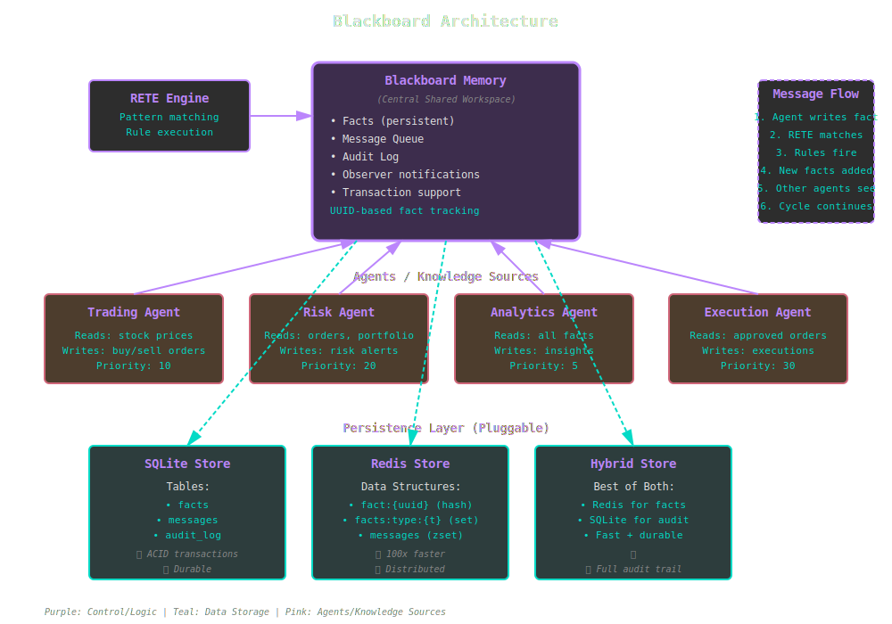

# Blackboard Architecture

The Blackboard pattern is a powerful approach to multi-agent problem-solving where independent knowledge sources collaborate through a shared workspace.

## Overview



*Blackboard system with multiple agents reading and writing to shared persistent memory with pluggable storage backends.*

## Core Concept

The blackboard architecture consists of three main components:

1. **Blackboard (Memory)**: Central shared workspace for facts
2. **Knowledge Sources (Agents)**: Independent experts that read and write facts
3. **Control Component**: Coordinates agent execution (often via rules)

Agents operate asynchronously, triggered by changes to the blackboard state. Each agent:
- Reads relevant facts from the blackboard
- Performs reasoning or computation
- Writes conclusions back to the blackboard
- Triggers other agents via fact changes

## KBS Implementation

### Blackboard::Memory

The central workspace that replaces `WorkingMemory` with persistence:

```ruby
require 'kbs/blackboard'

# Create blackboard with SQLite backend
memory = KBS::Blackboard::Memory.new(db_path: 'knowledge_base.db')

# Add facts (persisted automatically)
fact = memory.add_fact(:stock, {
  symbol: "AAPL",
  price: 150.50,
  timestamp: Time.now
})
# => #<KBS::Blackboard::Fact uuid="abc-123" ...>

# Query facts
stocks = memory.facts_of_type(:stock)
# => [#<KBS::Blackboard::Fact ...>, ...]

# Facts survive process restart
memory2 = KBS::Blackboard::Memory.new(db_path: 'knowledge_base.db')
memory2.facts_of_type(:stock)
# => Still there!
```

**Implementation**: `lib/kbs/blackboard/memory.rb`

### Blackboard::Engine

RETE engine with persistent blackboard memory:

```ruby
# Create engine with blackboard
engine = KBS::Blackboard::Engine.new(db_path: 'trading.db')

# Define rules (persisted in the database)
engine.add_rule(Rule.new("buy_signal") do |r|
  r.conditions = [
    Condition.new(:stock, { symbol: :?sym, price: :?price }),
    Condition.new(:threshold, { symbol: :?sym, max: :?max })
  ]

  r.action = lambda do |facts, bindings|
    if bindings[:?price] < bindings[:?max]
      # Write new fact to blackboard
      engine.add_fact(:order, {
        symbol: bindings[:?sym],
        action: "BUY",
        price: bindings[:?price]
      })
    end
  end
end)

# Facts trigger rules, which create new facts
engine.add_fact(:stock, symbol: "AAPL", price: 145.0)
engine.add_fact(:threshold, symbol: "AAPL", max: 150.0)
engine.run
# => Creates :order fact in blackboard
```

**Implementation**: `lib/kbs/blackboard/engine.rb`

### Message Queue

Priority-based communication between agents:

```ruby
memory = KBS::Blackboard::Memory.new(db_path: 'system.db')
queue = memory.message_queue

# Agent 1: Post high-priority message
queue.post("risk_analysis", {
  alert: "High volatility detected",
  severity: "critical"
}, priority: 10)

# Agent 2: Read and process messages
messages = queue.read("risk_analysis", limit: 5)
messages.each do |msg|
  puts "Processing: #{msg[:data][:alert]}"
  queue.acknowledge(msg[:id])
end

# Unacknowledged messages remain in queue
pending = queue.pending("risk_analysis")
```

**Implementation**: `lib/kbs/blackboard/message_queue.rb`

### Audit Log

Complete history of all changes for compliance and debugging:

```ruby
memory = KBS::Blackboard::Memory.new(db_path: 'audit.db')
audit = memory.audit_log

# All fact changes are logged automatically
fact = memory.add_fact(:stock, symbol: "AAPL", price: 150)
memory.update_fact(fact.id, price: 155)
memory.remove_fact(fact)

# Query audit trail
history = audit.fact_history(fact.id)
# => [
#   { action: "created", timestamp: ..., data: {price: 150} },
#   { action: "updated", timestamp: ..., data: {price: 155} },
#   { action: "deleted", timestamp: ... }
# ]

# See what rules fired
rule_log = audit.rules_fired(limit: 10)
# => [
#   { rule_name: "buy_signal", timestamp: ..., facts: [...] },
#   ...
# ]

# Recent changes across all facts
recent = audit.recent_changes(limit: 20)
```

**Implementation**: `lib/kbs/blackboard/audit_log.rb`

## Persistence Backends

### SQLite Store (Default)

Best for: Single-process applications, development, small-to-medium data.

```ruby
engine = KBS::Blackboard::Engine.new(db_path: 'kb.db')
```

**Pros:**
- ✅ Zero configuration (no server needed)
- ✅ ACID transactions
- ✅ Durable across restarts
- ✅ Simple backup (copy .db file)
- ✅ Full-text search capabilities

**Cons:**
- ⚠️ Slower than Redis (still fast for most use cases)
- ⚠️ Single-writer limitation
- ⚠️ Not distributed

**Schema:**
```sql
CREATE TABLE facts (
  id TEXT PRIMARY KEY,
  fact_type TEXT NOT NULL,
  attributes TEXT NOT NULL, -- JSON
  created_at DATETIME DEFAULT CURRENT_TIMESTAMP,
  updated_at DATETIME DEFAULT CURRENT_TIMESTAMP
);

CREATE TABLE audit_log (
  id INTEGER PRIMARY KEY AUTOINCREMENT,
  fact_id TEXT,
  action TEXT NOT NULL,
  timestamp DATETIME DEFAULT CURRENT_TIMESTAMP,
  data TEXT -- JSON
);

CREATE TABLE messages (
  id TEXT PRIMARY KEY,
  topic TEXT NOT NULL,
  priority INTEGER DEFAULT 0,
  data TEXT NOT NULL, -- JSON
  created_at DATETIME DEFAULT CURRENT_TIMESTAMP,
  acknowledged BOOLEAN DEFAULT 0
);
```

**Implementation**: `lib/kbs/blackboard/persistence/sqlite_store.rb`

### Redis Store

Best for: High-throughput applications, distributed systems, real-time trading.

```ruby
store = KBS::Blackboard::Persistence::RedisStore.new(
  url: 'redis://localhost:6379/0'
)
engine = KBS::Blackboard::Engine.new(store: store)
```

**Pros:**
- ✅ **100x faster** than SQLite for reads/writes
- ✅ Supports distributed agents (multiple processes, machines)
- ✅ Built-in pub/sub for real-time notifications
- ✅ Atomic operations
- ✅ TTL support for ephemeral facts

**Cons:**
- ⚠️ Requires Redis server
- ⚠️ Volatile by default (enable RDB/AOF for durability)
- ⚠️ More complex deployment

**Data Structures:**
```
# Facts stored as Redis hashes
fact:{uuid} → { type: "stock", symbol: "AAPL", price: 150 }

# Indexes for efficient queries
facts:type:stock → Set of fact UUIDs
facts:active → Set of all active fact UUIDs

# Messages as sorted sets (by priority)
messages:risk_alerts → ZSet[(msg1, priority), (msg2, priority), ...]

# Audit as lists
fact_history:{uuid} → List of change records
rules_fired:all → List of rule executions
```

**Implementation**: `lib/kbs/blackboard/persistence/redis_store.rb`

### Hybrid Store

Best for: Production systems needing speed + durability + audit.

```ruby
store = KBS::Blackboard::Persistence::HybridStore.new(
  redis_url: 'redis://localhost:6379/0',
  db_path: 'audit.db'
)
engine = KBS::Blackboard::Engine.new(store: store)
```

**Strategy:**
- **Redis**: Facts and messages (fast access)
- **SQLite**: Audit log (durable history)

**Pros:**
- ✅ Fast fact operations (Redis)
- ✅ Durable audit trail (SQLite)
- ✅ Best of both worlds

**Cons:**
- ⚠️ Requires both Redis and SQLite
- ⚠️ Slightly more complex

**Implementation**: `lib/kbs/blackboard/persistence/hybrid_store.rb`

## Multi-Agent Example

Trading system with four specialized agents:

```ruby
# Shared blackboard
blackboard = KBS::Blackboard::Engine.new(db_path: 'trading.db')

# Agent 1: Market Data Collector
data_agent = KBS::Rule.new("collect_data", priority: 5) do |r|
  r.conditions = [
    Condition.new(:market_open, { status: true }),
    Condition.new(:stock_data, { symbol: :?sym }, negated: true)
  ]

  r.action = lambda do |facts, bindings|
    price = fetch_current_price(bindings[:?sym])
    blackboard.add_fact(:stock_data, {
      symbol: bindings[:?sym],
      price: price,
      timestamp: Time.now
    })
  end
end

# Agent 2: Signal Generator
signal_agent = KBS::Rule.new("generate_signals", priority: 10) do |r|
  r.conditions = [
    Condition.new(:stock_data, { symbol: :?sym, price: :?price }),
    Condition.new(:sma_data, { symbol: :?sym, sma: :?sma })
  ]

  r.action = lambda do |facts, bindings|
    if bindings[:?price] > bindings[:?sma]
      blackboard.add_fact(:signal, {
        symbol: bindings[:?sym],
        direction: "BUY",
        strength: (bindings[:?price] / bindings[:?sma]) - 1.0
      })
    end
  end
end

# Agent 3: Risk Manager
risk_agent = KBS::Rule.new("check_risk", priority: 20) do |r|
  r.conditions = [
    Condition.new(:signal, { symbol: :?sym, direction: :?dir }),
    Condition.new(:portfolio, { symbol: :?sym, position: :?pos })
  ]

  r.action = lambda do |facts, bindings|
    if bindings[:?pos] > 1000 && bindings[:?dir] == "BUY"
      blackboard.add_fact(:risk_alert, {
        symbol: bindings[:?sym],
        reason: "Position limit exceeded"
      })
    else
      blackboard.add_fact(:approved_signal, {
        symbol: bindings[:?sym],
        direction: bindings[:?dir]
      })
    end
  end
end

# Agent 4: Order Executor
exec_agent = KBS::Rule.new("execute_orders", priority: 30) do |r|
  r.conditions = [
    Condition.new(:approved_signal, { symbol: :?sym, direction: :?dir }),
    Condition.new(:risk_alert, { symbol: :?sym }, negated: true)
  ]

  r.action = lambda do |facts, bindings|
    execute_trade(bindings[:?sym], bindings[:?dir])
    blackboard.add_fact(:execution, {
      symbol: bindings[:?sym],
      direction: bindings[:?dir],
      timestamp: Time.now
    })
  end
end

# Register all agents
[data_agent, signal_agent, risk_agent, exec_agent].each do |agent|
  blackboard.add_rule(agent)
end

# Trigger the system
blackboard.add_fact(:market_open, status: true)
blackboard.add_fact(:portfolio, symbol: "AAPL", position: 500)

# Agents collaborate through blackboard
blackboard.run
```

## Transactions

Ensure atomic multi-fact updates:

```ruby
memory = KBS::Blackboard::Memory.new(db_path: 'trades.db')

memory.transaction do
  # All or nothing
  order = memory.add_fact(:order, {
    symbol: "AAPL",
    action: "BUY",
    quantity: 100
  })

  execution = memory.add_fact(:execution, {
    order_id: order.id,
    price: 150.50,
    timestamp: Time.now
  })

  memory.update_fact(order.id, status: "filled")

  # If any operation fails, entire transaction rolls back
end
```

**Nested transactions** are supported via reference counting.

## Best Practices

### 1. Agent Specialization
Each agent should focus on one aspect of the problem:
- ✅ Data collection
- ✅ Signal generation
- ✅ Risk assessment
- ✅ Execution

### 2. Priority-Based Execution
Use rule priorities to ensure correct agent ordering:
```ruby
data_collector:  priority: 5
signal_generator: priority: 10
risk_manager:     priority: 20
executor:         priority: 30
```

### 3. Fact Versioning
Include timestamps for temporal reasoning:
```ruby
engine.add_fact(:price, {
  symbol: "AAPL",
  value: 150,
  timestamp: Time.now,
  source: "market_data_feed"
})
```

### 4. Message Acknowledgment
Always acknowledge processed messages:
```ruby
messages = queue.read("alerts", limit: 10)
messages.each do |msg|
  process_alert(msg[:data])
  queue.acknowledge(msg[:id])  # Important!
end
```

### 5. Audit Everything
Use audit log for debugging and compliance:
```ruby
# When something goes wrong, trace back
audit = memory.audit_log
changes = audit.recent_changes(limit: 100)
changes.each do |change|
  puts "#{change[:timestamp]}: #{change[:action]} on #{change[:fact_type]}"
end
```

## Performance Tuning

### Choose the Right Backend

| Backend | Use Case | Performance | Durability |
|---------|----------|-------------|------------|
| SQLite | Development, single-process | Good | Excellent |
| Redis | High-frequency trading, distributed | Excellent | Good (with AOF) |
| Hybrid | Production systems | Excellent | Excellent |

### Batch Operations

```ruby
# Bad: Individual adds (slow)
1000.times do |i|
  memory.add_fact(:reading, sensor: i, value: rand)
end

# Good: Transaction batch (fast)
memory.transaction do
  1000.times do |i|
    memory.add_fact(:reading, sensor: i, value: rand)
  end
end
```

### Index Strategy (SQLite)

```sql
-- Add indexes for frequent queries
CREATE INDEX idx_facts_type ON facts(fact_type);
CREATE INDEX idx_facts_created ON facts(created_at);
CREATE INDEX idx_messages_topic ON messages(topic, priority);
```

### Redis Memory Management

```ruby
# Set TTL for ephemeral facts
store = KBS::Blackboard::Persistence::RedisStore.new(
  url: 'redis://localhost:6379/0',
  ttl: 3600  # Facts expire after 1 hour
)
```

## Advanced Patterns

### Opportunistic Triggering

Agents activate when their preconditions are met:

```ruby
# Trigger fires only when specific fact exists
trigger_rule = Rule.new("on_critical_alert") do |r|
  r.conditions = [
    Condition.new(:alert, { severity: "critical" })
  ]

  r.action = lambda { |facts|
    notify_team(facts[0])
  end
end
```

### Blackboard Focus

Limit agent attention to relevant facts:

```ruby
# Agent only sees recent stock data
recent_data_rule = Rule.new("analyze_recent") do |r|
  r.conditions = [
    Condition.new(:stock_data, {
      symbol: :?sym,
      timestamp: ->(ts) { Time.now - ts < 300 }  # Last 5 minutes
    })
  ]

  r.action = lambda { |facts, bindings|
    # Process recent data only
  }
end
```

### Conflict Resolution

When multiple agents could act, use priorities:

```ruby
# High priority: Stop-loss overrides everything
stop_loss = Rule.new("stop_loss", priority: 100)

# Medium priority: Risk management
risk_check = Rule.new("risk_check", priority: 50)

# Low priority: Normal trading signals
buy_signal = Rule.new("buy", priority: 10)
```

## Next Steps

- **[Network Structure](network-structure.md)** - How blackboard integrates with RETE
- **[Persistence Guide](../guides/persistence.md)** - Choosing and configuring backends
- **[Multi-Agent Example](../examples/multi-agent.md)** - Complete working system
- **[Custom Persistence](../advanced/custom-persistence.md)** - Build your own backend
