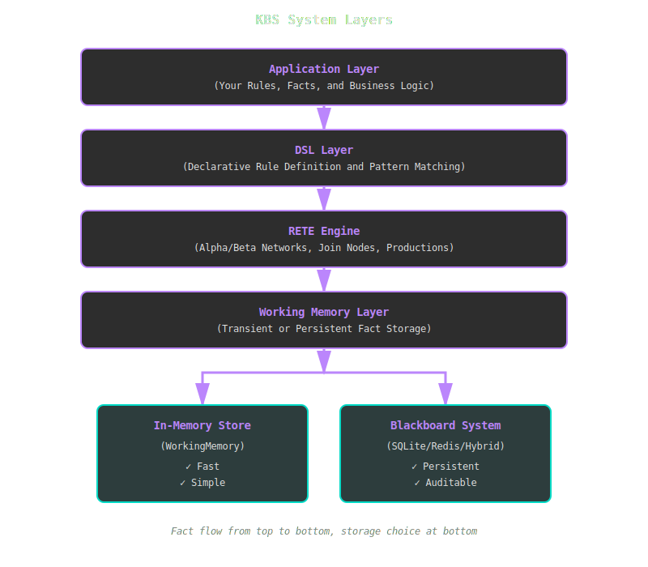
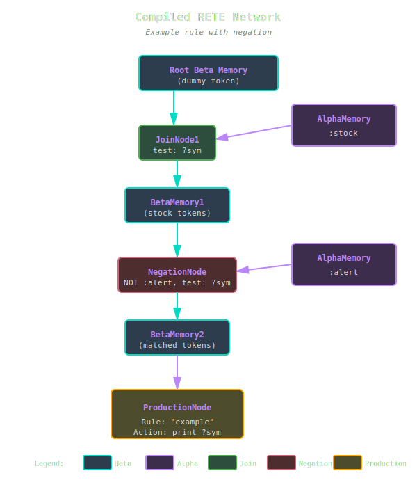

# Architecture Overview

KBS is built on a layered architecture that separates concerns while maintaining high performance.

## System Layers



*KBS uses a layered architecture where facts flow from your application through the DSL, RETE engine, and working memory to one of two storage backends.*

## Core Components

### 1. RETE Engine

The heart of KBS. Implements Charles Forgy's RETE algorithm with modern optimizations.

**Key Files:**
- `lib/kbs/rete_engine.rb` - Main engine coordinator
- `lib/kbs/alpha_memory.rb` - Pattern-level fact storage
- `lib/kbs/beta_memory.rb` - Token (partial match) storage
- `lib/kbs/join_node.rb` - Inter-condition joins
- `lib/kbs/negation_node.rb` - Negated condition handling
- `lib/kbs/production_node.rb` - Rule firing coordination

**Responsibilities:**
- Compile rules into discrimination networks
- Propagate fact changes through the network
- Maintain partial matches (tokens)
- Fire rules when all conditions are satisfied

**Learn more**: [RETE Algorithm Details](rete-algorithm.md)

### 2. Working Memory

Stores facts and notifies the RETE engine of changes using the Observer pattern.

**Variants:**
- **`WorkingMemory`**: Transient in-memory storage
- **`Blackboard::Memory`**: Persistent storage with audit trails

**Responsibilities:**
- Store facts
- Notify observers when facts are added/removed
- Support queries and bulk operations

**Learn more**: [Blackboard Architecture](blackboard.md)

### 3. DSL Layer

Provides a Ruby-native interface for defining rules, conditions, and patterns.

**Key Classes:**
- `Rule` - Production rule with conditions and actions
- `Condition` - Pattern specification for fact matching
- `Fact` - Knowledge representation unit

**Example:**
```ruby
Rule.new("alert") do |r|
  r.conditions = [
    Condition.new(:sensor, { temp: :t? }),
    Condition.new(:threshold, { max: :max? })
  ]

  r.action = lambda { |facts, bindings|
    puts "Alert!" if bindings[:t?] > bindings[:max?]
  }
end
```

### 4. Blackboard System

Multi-agent collaboration framework with persistent shared memory.

**Components:**
- **Memory** - Central workspace for facts
- **MessageQueue** - Priority-based agent communication
- **AuditLog** - Complete history of changes
- **Persistence** - Pluggable storage backends (SQLite, Redis, Hybrid)

**Use Cases:**
- Multi-agent problem solving
- Audit requirements
- Long-running systems
- Distributed reasoning

**Learn more**: [Blackboard System Details](blackboard.md)

## Data Flow

### Adding a Fact

```
User Code
   │
   ├─→ engine.add_fact(:stock, price: 150)
   │
   ▼
WorkingMemory.add_fact(fact)
   │
   ├─→ @facts << fact
   └─→ notify_observers(:add, fact)
          │
          ▼
       Engine.update(:add, fact)
          │
          └─→ For each AlphaMemory:
                 if fact.matches?(pattern)
                    │
                    ▼
                 AlphaMemory.activate(fact)
                    │
                    └─→ JoinNode.right_activate(fact)
                           │
                           └─→ Create tokens, propagate...
                                  │
                                  ▼
                               ProductionNode
```

### Firing Rules

```
User Code
   │
   ├─→ engine.run()
   │
   ▼
For each ProductionNode:
   │
   ├─→ For each token:
   │      │
   │      └─→ rule.fire(token.facts)
   │             │
   │             └─→ Extract bindings
   │                    │
   │                    └─→ Execute action lambda
   │                           │
   │                           └─→ User code in action
   │
   └─→ Mark tokens as fired
```

## Network Compilation

When you add a rule, KBS compiles it into a discrimination network:

```ruby
rule = Rule.new("example") do |r|
  r.conditions = [
    Condition.new(:stock, { symbol: :sym? }),
    Condition.new(:alert, { symbol: :sym? }, negated: true)
  ]
  r.action = ->(facts, bindings) { puts bindings[:sym?] }
end

engine.add_rule(rule)
```

**Compiled Network:**



*The rule compiles into a network with alpha memories for each condition type, join nodes to combine matches, a negation node for the NOT condition, and a production node that fires when all conditions are satisfied.*

**Learn more**: [Network Structure](network-structure.md)

## Performance Characteristics

| Operation | Complexity | Notes |
|-----------|-----------|-------|
| Add rule | O(C × F) | C = conditions, F = existing facts |
| Add fact | O(N) | N = activated nodes (typically << total) |
| Remove fact | O(T) | T = tokens containing fact |
| Fire rules | O(M) | M = complete matches |
| Network sharing | O(1) | Same pattern → same alpha memory |

## Design Principles

### 1. Algorithm Fidelity
Maintain RETE correctness per Forgy's specifications. No shortcuts that break semantics.

### 2. Separation of Concerns
- Engine: Pattern matching
- Memory: Storage
- DSL: User interface
- Blackboard: Collaboration

Each component is independently testable and swappable.

### 3. Performance Through Clarity
Optimize algorithm first (unlinking, network sharing), then profile before micro-optimizations.

### 4. Testability
Every method testable in isolation. Dependency injection for external services.

### 5. Graceful Degradation
Optional features (Redis, AI) don't block core functionality. Fallback to SQLite or in-memory.

### 6. Auditability
Complete audit trails for production systems. Know *why* a rule fired.

## Extension Points

### Custom Persistence

Implement `KBS::Blackboard::Persistence::Store`:

```ruby
class MyStore
  def save_fact(fact) ... end
  def load_facts(type) ... end
  def delete_fact(id) ... end
  # ...
end

engine = KBS::Blackboard::Engine.new(store: MyStore.new)
```

### Custom Pattern Matching

Override `Fact#matches?`:

```ruby
class MyFact < KBS::Fact
  def matches?(pattern)
    # Custom matching logic
  end
end
```

### Custom Rule Actions

Actions are lambdas - inject any Ruby code:

```ruby
r.action = lambda do |facts, bindings|
  send_email(bindings[:alert?])
  log_to_database(facts)
  trigger_api_call(bindings)
end
```

## File Organization

```
lib/kbs/
├── rete_engine.rb         # Main engine
├── working_memory.rb      # Fact storage
├── fact.rb                # Fact representation
├── rule.rb                # Rule definition
├── condition.rb           # Pattern specification
├── token.rb               # Partial match
├── alpha_memory.rb        # Pattern-level cache
├── beta_memory.rb         # Token storage
├── join_node.rb           # Inter-condition joins
├── negation_node.rb       # Negated conditions
├── production_node.rb     # Rule firing
└── blackboard/            # Persistent memory
    ├── engine.rb          # Blackboard-aware RETE
    ├── memory.rb          # Central workspace
    ├── fact.rb            # Persisted fact
    ├── message_queue.rb   # Agent communication
    ├── audit_log.rb       # Change history
    └── persistence/       # Storage backends
        ├── store.rb       # Abstract interface
        ├── sqlite_store.rb
        ├── redis_store.rb
        └── hybrid_store.rb
```

## Next Steps

- **[RETE Algorithm](rete-algorithm.md)** - Deep dive into pattern matching
- **[Blackboard System](blackboard.md)** - Persistent memory architecture
- **[Network Structure](network-structure.md)** - How rules compile into networks
- **[API Reference](../api/index.md)** - Complete class documentation
