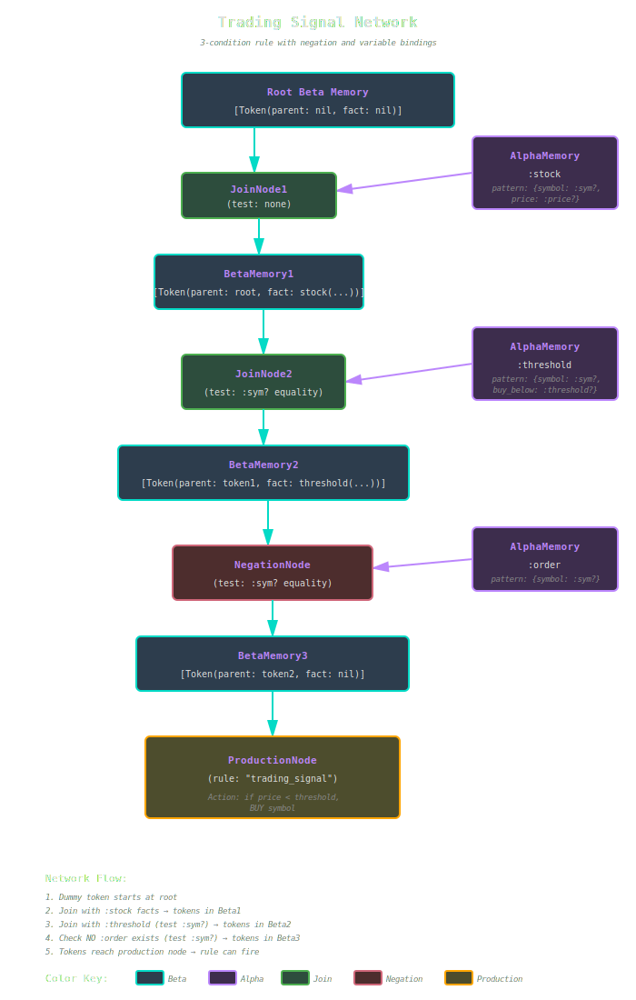

# Network Structure

How RETE compiles rules into an efficient discrimination network.

## Overview

When you add a rule to the engine, KBS compiles it into a discrimination network—a directed acyclic graph (DAG) of nodes that efficiently matches patterns against facts. This document explains the compilation process, node types, and optimization strategies.

## Network Compilation Process

### Step 1: Parse Rule Conditions

```ruby
rule = Rule.new("example") do |r|
  r.conditions = [
    Condition.new(:stock, { symbol: :?sym, price: :?price }),
    Condition.new(:threshold, { symbol: :?sym, max: :?max })
  ]
  r.action = lambda { |facts, bindings| ... }
end
```

The engine extracts:
- Condition types (`:stock`, `:threshold`)
- Patterns (attribute constraints)
- Variable bindings (`:?sym`, `:?price`, `:?max`)
- Join tests (`:?sym` appears in both conditions)

### Step 2: Create or Reuse Alpha Memories

For each condition, the engine creates or reuses an `AlphaMemory` node:

```ruby
# Pattern for first condition
pattern1 = { type: :stock, symbol: :?sym, price: :?price }
alpha1 = get_or_create_alpha_memory(pattern1)

# Pattern for second condition
pattern2 = { type: :threshold, symbol: :?sym, max: :?max }
alpha2 = get_or_create_alpha_memory(pattern2)
```

**Network Sharing**: If another rule has the same pattern, they share the same alpha memory node.

### Step 3: Build Join Network

Connect conditions through join nodes:

```ruby
# Start with root beta memory (contains dummy token)
current_beta = @root_beta_memory

# For each condition
rule.conditions.each do |condition|
  alpha_memory = get_or_create_alpha_memory(condition.pattern)

  # Build join tests for variable consistency
  tests = extract_join_tests(condition)

  # Create join or negation node
  if condition.negated
    node = NegationNode.new(alpha_memory, current_beta, tests)
  else
    node = JoinNode.new(alpha_memory, current_beta, tests)
  end

  # Create beta memory to store results
  new_beta = BetaMemory.new
  node.successors << new_beta
  current_beta = new_beta
end
```

### Step 4: Attach Production Node

```ruby
production_node = ProductionNode.new(rule)
current_beta.successors << production_node
@production_nodes[rule.name] = production_node
```

## Node Types

### Alpha Memory Nodes

**Purpose**: Store facts matching a specific pattern

**Structure**:
```ruby
class AlphaMemory
  attr_accessor :items      # Facts that match pattern
  attr_accessor :successors # Join nodes using this alpha
  attr_accessor :pattern    # Pattern to match
  attr_reader :linked       # Unlinking state
end
```

**Example**:
```
AlphaMemory(stock, symbol: "AAPL")
  items: [stock(symbol: "AAPL", price: 150), ...]
  successors: [JoinNode1, JoinNode2, ...]
```

### Beta Memory Nodes

**Purpose**: Store partial matches (tokens) as they propagate

**Structure**:
```ruby
class BetaMemory
  attr_accessor :tokens     # Partial matches
  attr_accessor :successors # Next nodes in network
  attr_reader :linked       # Unlinking state
end
```

**Example**:
```
BetaMemory
  tokens: [
    Token(parent: root, fact: stock(...)),
    Token(parent: root, fact: stock(...))
  ]
  successors: [JoinNode2]
```

### Join Nodes

**Purpose**: Combine facts from alpha memory with tokens from beta memory

**Structure**:
```ruby
class JoinNode
  attr_accessor :alpha_memory  # Right input
  attr_accessor :beta_memory   # Left input
  attr_accessor :tests         # Join tests to perform
  attr_accessor :successors    # Beta memory nodes
end
```

**Join Tests**:
```ruby
{
  token_field_index: 0,    # Check first fact in token
  token_field: :symbol,    # Get its :symbol attribute
  fact_field: :symbol,     # Compare with new fact's :symbol
  operation: :eq           # Must be equal
}
```

### Negation Nodes

**Purpose**: Implement negated conditions (match when pattern is absent)

**Structure**:
```ruby
class NegationNode
  attr_accessor :alpha_memory       # Pattern to check
  attr_accessor :beta_memory        # Tokens to test
  attr_accessor :tests              # Join tests
  attr_accessor :tokens_with_matches # Track inhibiting facts
end
```

**Behavior**:
- Token arrives → check alpha memory for matches
- No matches found → propagate token (condition satisfied)
- Matches found → block token (condition not satisfied)
- Match removed → unblock token

### Production Nodes

**Purpose**: Fire rule actions when all conditions match

**Structure**:
```ruby
class ProductionNode
  attr_accessor :rule   # Rule to fire
  attr_accessor :tokens # Complete matches ready to fire
end
```

## Complete Example

### Rule Definition

```ruby
rule = Rule.new("trading_signal") do |r|
  r.conditions = [
    Condition.new(:stock, { symbol: :?sym, price: :?price }),
    Condition.new(:threshold, { symbol: :?sym, buy_below: :?threshold }),
    Condition.new(:order, { symbol: :?sym }, negated: true)
  ]

  r.action = lambda do |facts, bindings|
    if bindings[:?price] < bindings[:?threshold]
      puts "BUY #{bindings[:?sym]}"
    end
  end
end
```

### Compiled Network



*The trading signal rule compiles into a network with three join points. The first two join nodes combine stock and threshold facts based on matching symbols. The negation node ensures no existing order for that symbol. Tokens propagate through beta memories, carrying partial matches until reaching the production node.*

## Optimization Strategies

### Network Sharing

Multiple rules with common patterns share alpha memory nodes:

```ruby
# Rule 1
Condition.new(:stock, { symbol: "AAPL" })

# Rule 2
Condition.new(:stock, { symbol: "AAPL" })

# Both use the same AlphaMemory node
# Only one pattern match, one fact storage
```

### Unlinking

Empty nodes automatically disconnect to avoid wasted computation:

```ruby
# BetaMemory becomes empty
beta_memory.remove_token(last_token)
# => Calls unlink!

# Downstream nodes stop processing
join_node.left_activate(token)  # Returns early if !@left_linked
```

### Condition Ordering

Place selective conditions first to minimize beta memory size:

```ruby
# Good: Specific condition first
conditions = [
  Condition.new(:critical_alert, { severity: "critical" }),  # Few matches
  Condition.new(:stock, { symbol: :?sym })                   # Many matches
]

# Bad: General condition first
conditions = [
  Condition.new(:stock, { symbol: :?sym }),                  # Many matches
  Condition.new(:critical_alert, { severity: "critical" })   # Few matches
]
```

### Variable Binding Extraction

Variables create join tests automatically:

```ruby
# Rule with :?sym in two conditions
tests = [
  {
    token_field_index: 0,     # First fact in token (stock)
    token_field: :symbol,
    fact_field: :symbol,      # New fact (threshold)
    operation: :eq
  }
]
```

## Network Inspection

### Debugging Network Structure

```ruby
# See all alpha memories
engine.alpha_memories.each do |pattern, memory|
  puts "Pattern: #{pattern}"
  puts "  Facts: #{memory.items.size}"
  puts "  Linked: #{memory.linked}"
  puts "  Successors: #{memory.successors.size}"
end

# See production nodes
engine.production_nodes.each do |name, node|
  puts "Rule: #{name}"
  puts "  Tokens: #{node.tokens.size}"
end
```

### Visualizing Token Flow

Enable tracing in actions:

```ruby
r.action = lambda do |facts, bindings|
  puts "Rule '#{rule.name}' fired"
  puts "  Facts: #{facts.map(&:to_s).join(', ')}"
  puts "  Bindings: #{bindings.inspect}"
end
```

## Performance Implications

### Time Complexity

| Operation | Complexity | Notes |
|-----------|-----------|-------|
| Add rule | O(C × F) | C = conditions, F = facts |
| Network sharing lookup | O(1) | Hash-based pattern cache |
| Join test | O(T) | T = number of tests |
| Token propagation | O(S) | S = successors |

### Space Complexity

| Structure | Space | Notes |
|-----------|-------|-------|
| Alpha memories | O(P) | P = unique patterns across all rules |
| Beta memories | O(R × C) | R = rules, C = avg conditions |
| Tokens | O(M × C) | M = complete matches |
| Join nodes | O(R × C) | One per condition |

### Optimization Tips

1. **Maximize network sharing**: Design rules to reuse common patterns
2. **Order conditions by selectivity**: Specific first, general last
3. **Minimize negations**: Expensive to maintain
4. **Use predicates sparingly**: Can't be shared across rules
5. **Profile your rules**: Use debugging to identify bottlenecks

## Next Steps

- **[RETE Algorithm](rete-algorithm.md)** - Understand the full execution cycle
- **[Blackboard System](blackboard.md)** - Persistent network state
- **[Performance Tuning](../advanced/performance.md)** - Optimize for production
- **[Debugging Guide](../advanced/debugging.md)** - Inspect network state

---

*This document describes implementation details in `lib/kbs/rete_engine.rb:58` (network compilation) and related node classes.*
