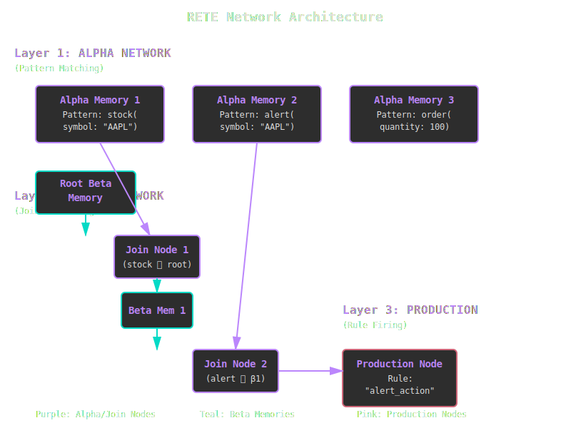
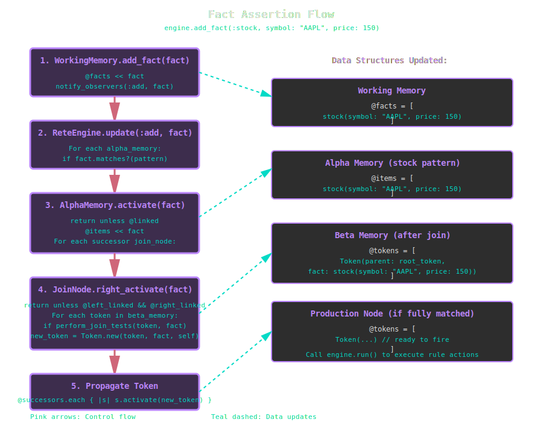
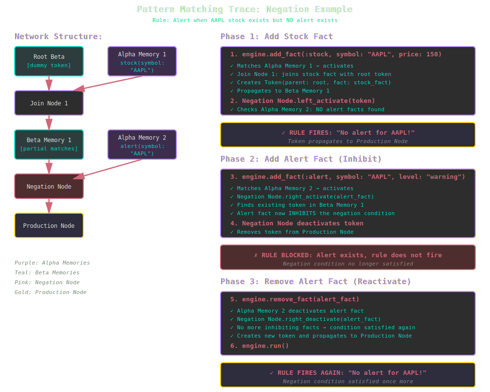

# The RETE Algorithm in KBS

## Overview

The RETE algorithm is a pattern matching algorithm for implementing production rule systems. Developed by Charles Forgy in 1979, RETE (Latin for "network") creates a discrimination network that efficiently matches rules against a working memory of facts. KBS implements the RETE algorithm with the critical **unlinking optimization** for improved performance.

## Why RETE?

Traditional rule engines evaluate all rules against all facts on every cycle, resulting in O(R × F) complexity where R is the number of rules and F is the number of facts. RETE achieves near-constant time per working memory change by:

1. **Sharing common patterns** across rules in a compiled network
2. **Maintaining state** between cycles (incremental matching)
3. **Processing only changes** rather than re-evaluating everything
4. **Unlinking empty nodes** to skip unnecessary computation (RETE optimization)

## Core Concepts

### Facts

Facts are the fundamental units of knowledge in the system. Each fact has:

- **Type**: A symbol identifying the kind of fact (e.g., `:stock`, `:alert`, `:order`)
- **Attributes**: Key-value pairs containing the fact's data
- **ID**: A unique identifier (object_id for transient facts, UUID for persisted facts)

```ruby
# Creating a fact
fact = engine.add_fact(:stock, symbol: "AAPL", price: 150.0, volume: 1000000)

# Fact structure
# => stock(symbol: AAPL, price: 150.0, volume: 1000000)
```

**Implementation**: `lib/kbs/fact.rb:4`

### Working Memory

Working memory is the collection of all facts currently known to the system. It implements the **Observer pattern** to notify the RETE network when facts are added or removed.

```ruby
class WorkingMemory
  def add_fact(fact)
    @facts << fact
    notify_observers(:add, fact)  # Triggers RETE propagation
  end

  def remove_fact(fact)
    @facts.delete(fact)
    notify_observers(:remove, fact)  # Triggers retraction
  end
end
```

**Implementation**: `lib/kbs/working_memory.rb:4`

### Conditions and Patterns

A condition specifies a pattern that facts must match. Patterns can include:

- **Type matching**: `{ type: :stock }`
- **Literal values**: `{ symbol: "AAPL" }`
- **Variable bindings**: `{ price: :price? }` (variables start with `?`)
- **Predicates**: `{ price: ->(p) { p > 100 } }`
- **Negation**: `negated: true` (match when pattern is absent)

```ruby
# Match any stock with symbol "AAPL"
Condition.new(:stock, { symbol: "AAPL" })

# Match stock and bind price to ?price variable
Condition.new(:stock, { symbol: "AAPL", price: :price? })

# Match when there is NO alert for "AAPL"
Condition.new(:alert, { symbol: "AAPL" }, negated: true)
```

**Implementation**: `lib/kbs/condition.rb:4`

### Rules

Rules are production rules consisting of:

- **Conditions** (IF part): Patterns to match in working memory
- **Action** (THEN part): Code to execute when all conditions match
- **Priority**: Optional integer for conflict resolution (higher fires first)

```ruby
rule = Rule.new("high_price_alert") do |r|
  r.conditions = [
    Condition.new(:stock, { symbol: :symbol?, price: :price? }),
    Condition.new(:threshold, { symbol: :symbol?, max: :max? })
  ]

  r.action = lambda do |facts, bindings|
    if bindings[:price?] > bindings[:max?]
      puts "Alert: #{bindings[:symbol?]} at #{bindings[:price?]}"
    end
  end
end
```

**Implementation**: `lib/kbs/rule.rb:4`

### Tokens

Tokens represent **partial matches** as they flow through the RETE network. A token is a linked list of facts that have matched conditions so far.

```ruby
class Token
  attr_accessor :parent, :fact, :node, :children

  # Reconstruct the full chain of matched facts
  def facts
    facts = []
    token = self
    while token
      facts.unshift(token.fact) if token.fact
      token = token.parent
    end
    facts
  end
end
```

**Key insights**:
- The **root token** has `parent = nil`, `fact = nil` and represents "no conditions matched yet"
- Each join creates a **new token** linking to its parent token plus a new fact
- Tokens form a **tree structure** via the `children` array, enabling efficient retraction

**Implementation**: `lib/kbs/token.rb:4`

## Network Architecture

The RETE network is a **directed acyclic graph (DAG)** consisting of three layers:



*The three-layer RETE network architecture showing alpha memories (pattern matching), beta network (join processing), and production nodes (rule firing).*

### Layer 1: Alpha Network

The **alpha network** performs **intra-condition** tests - matching individual facts against patterns. Each `AlphaMemory` node:

- Stores facts matching a specific pattern
- Is shared across all rules using the same pattern (network sharing)
- Propagates matches to successor join nodes

```ruby
class AlphaMemory
  attr_accessor :items, :successors, :pattern

  def activate(fact)
    return unless @linked
    @items << fact
    @successors.each { |s| s.right_activate(fact) }
  end
end
```

**Example**: If three rules all match `stock(symbol: "AAPL")`, they share one `AlphaMemory` node for that pattern.

**Implementation**: `lib/kbs/alpha_memory.rb:4`

### Layer 2: Beta Network

The **beta network** performs **inter-condition** tests - joining facts from different conditions. It consists of:

#### Join Nodes

`JoinNode` combines tokens from **beta memory** (left input) with facts from **alpha memory** (right input):

```ruby
class JoinNode
  def left_activate(token)
    return unless @left_linked && @right_linked

    @alpha_memory.items.each do |fact|
      if perform_join_tests(token, fact)
        new_token = Token.new(token, fact, self)
        @successors.each { |s| s.activate(new_token) }
      end
    end
  end

  def right_activate(fact)
    return unless @left_linked && @right_linked

    @beta_memory.tokens.each do |token|
      if perform_join_tests(token, fact)
        new_token = Token.new(token, fact, self)
        @successors.each { |s| s.activate(new_token) }
      end
    end
  end
end
```

**Join tests** verify:
- Variable consistency (e.g., both conditions match same `:symbol?`)
- Cross-condition predicates (e.g., price1 > price2)

**Implementation**: `lib/kbs/join_node.rb:4`

#### Beta Memory

`BetaMemory` stores tokens (partial matches) and implements the **unlinking optimization**:

```ruby
class BetaMemory
  def add_token(token)
    @tokens << token
    unlink! if @tokens.empty?     # Unlink when empty
    relink! if @tokens.size == 1  # Relink when first token arrives
  end

  def remove_token(token)
    @tokens.delete(token)
    unlink! if @tokens.empty?     # Unlink when last token removed
  end
end
```

**Implementation**: `lib/kbs/beta_memory.rb:4`

#### Negation Nodes

`NegationNode` implements **negated conditions** (e.g., "when there is NO matching fact"):

```ruby
class NegationNode
  def left_activate(token)
    matches = @alpha_memory.items.select { |fact| perform_join_tests(token, fact) }

    if matches.empty?
      # No inhibiting facts found - propagate the token
      new_token = Token.new(token, nil, self)
      @successors.each { |s| s.activate(new_token) }
    else
      # Found inhibiting facts - block propagation
      @tokens_with_matches[token] = matches
    end
  end

  def right_deactivate(fact)
    # When an inhibiting fact is removed, check if we can now propagate
    @beta_memory.tokens.each do |token|
      if @tokens_with_matches[token].include?(fact)
        @tokens_with_matches[token].delete(fact)

        if @tokens_with_matches[token].empty?
          new_token = Token.new(token, nil, self)
          @successors.each { |s| s.activate(new_token) }
        end
      end
    end
  end
end
```

**Key insight**: Negation nodes propagate tokens with `fact = nil` since there's no actual fact to include.

**Implementation**: `lib/kbs/negation_node.rb:4`

### Layer 3: Production Nodes

`ProductionNode` is the terminal node for each rule. When a token reaches a production node, all rule conditions have been satisfied:

```ruby
class ProductionNode
  def activate(token)
    @tokens << token
    # Don't fire immediately - wait for engine.run()
  end

  def fire_rule(token)
    return if token.fired?
    @rule.fire(token.facts)
    token.mark_fired!
  end
end
```

**Why delay firing?** Negation nodes may need to **deactivate** tokens after they're created but before they fire. The two-phase approach (collect tokens, then fire) ensures correctness.

**Implementation**: `lib/kbs/production_node.rb:4`

## The RETE Cycle

### 1. Network Construction

When a rule is added via `engine.add_rule(rule)`, the network is built:

```ruby
def build_network_for_rule(rule)
  current_beta = @root_beta_memory

  rule.conditions.each_with_index do |condition, index|
    # Create or reuse alpha memory
    pattern = condition.pattern.merge(type: condition.type)
    alpha_memory = get_or_create_alpha_memory(pattern)

    # Build join tests for variable consistency
    tests = build_join_tests(condition, index)

    # Create join or negation node
    if condition.negated
      negation_node = NegationNode.new(alpha_memory, current_beta, tests)
      new_beta = BetaMemory.new
      negation_node.successors << new_beta
      current_beta = new_beta
    else
      join_node = JoinNode.new(alpha_memory, current_beta, tests)
      new_beta = BetaMemory.new
      join_node.successors << new_beta
      current_beta = new_beta
    end
  end

  # Terminal production node
  production_node = ProductionNode.new(rule)
  current_beta.successors << production_node
  @production_nodes[rule.name] = production_node
end
```

**Implementation**: `lib/kbs/rete_engine.rb:58`

### 2. Fact Assertion

When `engine.add_fact(:stock, symbol: "AAPL", price: 150)` is called:



*Step-by-step flow showing how a fact propagates through the RETE network from working memory to production nodes.*

### 3. Pattern Matching Flow

Let's trace a fact through the network for this rule:

```ruby
# Rule: Alert when AAPL stock exists but no alert exists
rule = Rule.new("no_alert") do |r|
  r.conditions = [
    Condition.new(:stock, { symbol: "AAPL" }),
    Condition.new(:alert, { symbol: "AAPL" }, negated: true)
  ]
  r.action = ->(facts) { puts "No alert for AAPL!" }
end
```



*Complete trace showing how negation works: adding a stock fact fires the rule, adding an alert inhibits it, and removing the alert reactivates the rule.*

### 4. Rule Execution

The final phase is `engine.run()`:

```ruby
def run
  @production_nodes.values.each do |node|
    node.tokens.each do |token|
      node.fire_rule(token)
    end
  end
end
```

Each production node fires its accumulated tokens. The `fired?` flag prevents duplicate firing.

**Implementation**: `lib/kbs/rete_engine.rb:48`

## RETE Optimization: Unlinking

### The Problem

In basic RETE, join nodes always process activations even when one input is empty:

```
BetaMemory (0 tokens) ──┐
                        ├──→ JoinNode ──→ (does useless work!)
AlphaMemory (100 facts) ┘
```

If beta memory is empty, the join will produce zero results, wasting CPU cycles.

### The Solution

RETE introduces **dynamic unlinking**: nodes automatically disconnect from the network when empty and reconnect when non-empty.

```ruby
class BetaMemory
  def add_token(token)
    @tokens << token
    relink! if @tokens.size == 1  # Reconnect when first token arrives
  end

  def remove_token(token)
    @tokens.delete(token)
    unlink! if @tokens.empty?     # Disconnect when empty
  end

  def relink!
    @linked = true
    @successors.each { |s| s.left_relink! }
  end

  def unlink!
    @linked = false
    @successors.each { |s| s.left_unlink! }
  end
end
```

**Join node respects linking state**:

```ruby
class JoinNode
  def left_activate(token)
    return unless @left_linked && @right_linked  # Skip if unlinked!
    # ... perform join ...
  end

  def right_activate(fact)
    return unless @left_linked && @right_linked  # Skip if unlinked!
    # ... perform join ...
  end
end
```

### Performance Impact

For rules with many conditions, unlinking can reduce RETE network activations by **90%+**:

- Empty alpha memories don't trigger join operations
- Empty beta memories don't process fact assertions
- Network "lights up" only the relevant paths

This is especially critical for:
- **Negated conditions** (often have empty alpha memories)
- **Rare patterns** (e.g., "critical alert" facts)
- **Complex rules** (many conditions = more opportunities for empty nodes)

## Variable Binding

Variables (symbols starting with `?`) enable cross-condition constraints and action parameterization:

### Extraction During Network Build

```ruby
class Condition
  def extract_variables(pattern)
    vars = {}
    pattern.each do |key, value|
      if value.is_a?(Symbol) && value.to_s.start_with?('?')
        vars[value] = key  # { :symbol? => :symbol, :price? => :price }
      end
    end
    vars
  end
end
```

**Implementation**: `lib/kbs/condition.rb:16`

### Join Test Generation

Variables create **join tests** to ensure consistency:

```ruby
# Rule with shared ?symbol variable
conditions = [
  Condition.new(:stock, { symbol: :symbol?, price: :price? }),
  Condition.new(:order, { symbol: :symbol?, quantity: 100 })
]

# Generates join test:
{
  token_field_index: 0,      # Check first fact in token (stock)
  token_field: :symbol,       # Get its :symbol attribute
  fact_field: :symbol,        # Compare with order's :symbol attribute
  operation: :eq              # Must be equal
}
```

**Implementation**: `lib/kbs/join_node.rb:89`

### Action Binding

When a rule fires, bindings are extracted for the action:

```ruby
def fire(facts)
  bindings = extract_bindings(facts)
  # bindings = { :symbol? => "AAPL", :price? => 150.0 }

  @action.call(facts, bindings)
end

def extract_bindings(facts)
  bindings = {}
  @conditions.each_with_index do |condition, index|
    next if condition.negated  # Negated conditions have no fact
    fact = facts[index]
    condition.variable_bindings.each do |var, field|
      bindings[var] = fact.attributes[field]
    end
  end
  bindings
end
```

**Implementation**: `lib/kbs/rule.rb:34`

## Advanced Topics

### Conflict Resolution

When multiple rules are activated simultaneously, KBS uses **priority** (higher values fire first):

```ruby
rule1 = Rule.new("urgent", priority: 10) { ... }
rule2 = Rule.new("normal", priority: 0) { ... }

# rule1 fires before rule2
```

For same-priority rules, firing order is deterministic but unspecified (depends on hash ordering).

### Fact Retraction

Removing facts triggers **recursive token deletion**:

```ruby
class JoinNode
  def right_deactivate(fact)
    tokens_to_remove = []

    @beta_memory.tokens.each do |token|
      # Find child tokens containing this fact
      token.children.select { |child| child.fact == fact }.each do |child|
        tokens_to_remove << child
        @successors.each { |s| s.deactivate(child) }  # Recursive!
      end
    end

    tokens_to_remove.each { |token| token.parent.children.delete(token) }
  end
end
```

This ensures **truth maintenance**: when a premise is removed, all derived conclusions are also removed.

**Implementation**: `lib/kbs/join_node.rb:72`

### Network Sharing

Alpha memories are **shared across rules** using pattern as the hash key:

```ruby
def get_or_create_alpha_memory(pattern)
  @alpha_memories[pattern] ||= AlphaMemory.new(pattern)
end
```

If 10 rules all match `stock(symbol: "AAPL")`, they share one `AlphaMemory` node, reducing:
- Memory usage (one fact store instead of 10)
- Computation (one pattern match instead of 10)

**Implementation**: `lib/kbs/rete_engine.rb:104`

### Incremental Matching

RETE is **incremental**: after the initial network build, only changes are processed. Adding a fact activates a small subgraph, not the entire network.

**Complexity**:
- Initial build: O(R × F) where R = rules, F = facts
- Per-fact addition: O(N) where N = activated nodes (typically << R × F)
- Per-fact removal: O(T) where T = tokens to remove

In practice, RETE can handle millions of facts with sub-millisecond updates.

## Debugging RETE Networks

### Visualizing Token Flow

Enable token tracing:

```ruby
class Token
  def to_s
    "Token(#{facts.map(&:to_s).join(', ')})"
  end
end

# In your rule action:
r.action = lambda do |facts, bindings|
  puts "Fired with facts: #{facts.map(&:to_s).join(', ')}"
  puts "Bindings: #{bindings.inspect}"
end
```

### Inspecting Network State

Check what's in memories:

```ruby
# Alpha memory contents
engine.alpha_memories.each do |pattern, memory|
  puts "Pattern #{pattern}: #{memory.items.size} facts"
  memory.items.each { |f| puts "  - #{f}" }
end

# Beta memory contents (requires introspection)
def walk_beta_network(beta)
  puts "Beta memory: #{beta.tokens.size} tokens"
  beta.tokens.each { |t| puts "  - #{t}" }
  beta.successors.each do |node|
    if node.is_a?(BetaMemory)
      walk_beta_network(node)
    end
  end
end
```

### Common Pitfalls

1. **Forgetting to call `engine.run()`**: Tokens accumulate but rules don't fire
2. **Pattern mismatches**: `{ type: :stock }` vs `Condition.new(:stock, {})` - the latter doesn't filter by type!
3. **Variable binding errors**: Using `?symbol` (string) instead of `:symbol?` (symbol)
4. **Negation timing**: Negated conditions only fire when facts are **absent**, not after they're removed (use `engine.run()` to re-evaluate)

## Performance Characteristics

### Time Complexity

| Operation | Complexity | Notes |
|-----------|-----------|-------|
| Add rule | O(C × F) | C = conditions, F = existing facts |
| Add fact | O(N) | N = activated nodes (avg << total nodes) |
| Remove fact | O(T) | T = tokens containing fact |
| Run rules | O(M) | M = matched tokens in production nodes |

### Space Complexity

| Structure | Space | Notes |
|-----------|-------|-------|
| Alpha memories | O(F × P) | F = facts, P = unique patterns |
| Beta memories | O(T) | T = partial match tokens |
| Tokens | O(C × M) | C = conditions, M = complete matches |
| Network nodes | O(R × C) | R = rules, C = avg conditions per rule |

### Optimization Strategies

1. **Pattern specificity**: Put most selective conditions first to reduce beta memory size
2. **Negation placement**: Place negated conditions last (they don't add facts to tokens)
3. **Shared patterns**: Design rules to share common patterns
4. **Fact pruning**: Remove obsolete facts to trigger unlinking
5. **Priority tuning**: Use priority to fire expensive rules last

## Comparison with Other Algorithms

### Naive Match-All

```ruby
# O(R × F) on every cycle
def naive_fire_rules
  rules.each do |rule|
    facts.each do |fact|
      if rule.matches?(fact)
        rule.fire(fact)
      end
    end
  end
end
```

**Problem**: Re-evaluates everything, no state preservation.

### TREAT

TREAT eliminates alpha/beta network in favor of lazy evaluation:
- **Pros**: Simpler implementation, lower memory
- **Cons**: Slower for rules that fire frequently (no memoization)

RETE is better when rules fire often; TREAT is better for sparse firing.

### Basic RETE vs RETE with Unlinking

Early RETE implementations lacked unlinking:
- **Without unlinking**: All nodes always active, many wasted join operations
- **With unlinking**: Nodes disconnect when empty, up to 10× faster

KBS implements RETE with unlinking optimization.

## Implementation Files

| Component | File | Lines |
|-----------|------|-------|
| Core engine | `lib/kbs/rete_engine.rb` | ~110 |
| Working memory | `lib/kbs/working_memory.rb` | ~35 |
| Facts | `lib/kbs/fact.rb` | ~45 |
| Tokens | `lib/kbs/token.rb` | ~40 |
| Alpha memory | `lib/kbs/alpha_memory.rb` | ~40 |
| Beta memory | `lib/kbs/beta_memory.rb` | ~60 |
| Join nodes | `lib/kbs/join_node.rb` | ~120 |
| Negation nodes | `lib/kbs/negation_node.rb` | ~90 |
| Production nodes | `lib/kbs/production_node.rb` | ~30 |
| Conditions | `lib/kbs/condition.rb` | ~30 |
| Rules | `lib/kbs/rule.rb` | ~50 |

**Total**: ~650 lines of core RETE implementation.

## Further Reading

### Academic Papers

- Forgy, C. (1982). "Rete: A Fast Algorithm for the Many Pattern/Many Object Pattern Match Problem". *Artificial Intelligence*, 19(1), 17-37.
- Forgy, C. (1989). "Rete: A Fast Match Algorithm". *AI Expert*, 4(1), 34-40.

### Textbooks

- Giarratano, J., & Riley, G. (2004). *Expert Systems: Principles and Programming* (4th ed.). Course Technology.
- Russell, S., & Norvig, P. (2020). *Artificial Intelligence: A Modern Approach* (4th ed.). Pearson. (Chapter on Rule-Based Systems)

### Online Resources

- [RETE Algorithm Visualization](http://www.jessrules.com/docs/71/rete.html) - Jess documentation
- [Production Systems](https://en.wikipedia.org/wiki/Production_system_(computer_science)) - Wikipedia
- [Rule-Based Expert Systems](https://www.cs.toronto.edu/~hector/PublicKnowledgeBase.html) - University of Toronto

## Next Steps

- **[DSL Guide](../guides/dsl.md)**: Learn how to write rules using KBS's Ruby DSL
- **[Blackboard Architecture](blackboard.md)**: Understand persistent memory and multi-agent systems
- **[Examples](../examples/index.md)**: See RETE in action with stock trading and expert systems
- **[Performance Tuning](../advanced/performance.md)**: Optimize your rule-based system
