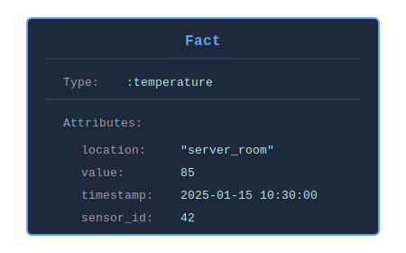
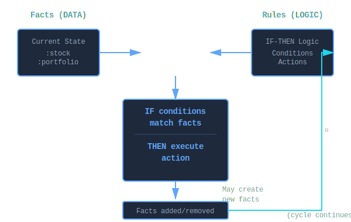

# What is a Fact?

A **fact** is the fundamental unit of knowledge in KBS - a piece of information about your domain that the system can reason about. Facts are the "data" on which rules operate.

## Core Concept

Think of a fact as a **typed data record** that represents something true at a particular moment:

- "The temperature in the server room is 85°F"
- "Stock AAPL is trading at $150.25 with volume 1.2M"
- "Sensor #42 is active"
- "Order #123 is pending"

Each fact has:

1. **Type** - What kind of thing this is (`:temperature`, `:stock`, `:sensor`, `:order`)
2. **Attributes** - Key-value pairs describing it (`location: "server_room"`, `value: 85`)

## Anatomy of a Fact

### Structure

```ruby
fact = KBS::Fact.new(:temperature, location: "server_room", value: 85)

fact.type        # => :temperature
fact.attributes  # => {:location => "server_room", :value => 85}
fact[:location]  # => "server_room"
fact[:value]     # => 85
```

### Visual Representation



*A fact consists of a type symbol and a hash of attribute key-value pairs.*

## How Facts Differ from Other Data Structures

| Aspect | Fact | Plain Hash | Database Row | Object |
|--------|------|-----------|--------------|--------|
| **Type** | Explicit (`:temperature`) | None | Table name | Class |
| **Pattern Matching** | Built-in | Manual | SQL WHERE | Manual |
| **Identity** | By content & type | By reference | By primary key | By reference |
| **Purpose** | Reasoning & inference | General storage | Persistent storage | Behavior + data |
| **Lifecycle** | Add/retract from KB | Create/destroy | Insert/delete | New/GC |

**Example Comparison:**

```ruby
# Plain Hash
data = { location: "server_room", value: 85 }
# What kind of data is this? No way to tell.

# Database Row
# SELECT * FROM temperatures WHERE location = 'server_room'
# Requires SQL, separate from logic

# Object
class Temperature
  attr_accessor :location, :value
end
temp = Temperature.new
# Has behavior but no built-in pattern matching

# Fact
fact = KBS::Fact.new(:temperature, location: "server_room", value: 85)
# Self-describing, pattern-matchable, inference-ready
```

## Fact Lifecycle

### 1. Creation

Facts are created and added to a knowledge base:

```ruby
# In-memory knowledge base
kb = KBS.knowledge_base do
  fact :temperature, location: "server_room", value: 85
end

# Blackboard (persistent)
engine = KBS::Blackboard::Engine.new(db_path: 'kb.db')
fact = engine.add_fact(:temperature, location: "server_room", value: 85)
```

### 2. Pattern Matching

Once added, facts are automatically matched against rule patterns:

```ruby
rule "high_temperature" do
  # This pattern matches our fact above
  on :temperature, location: "server_room", value: greater_than(80)
  perform { puts "Alert!" }
end
```

### 3. Rule Firing

When all conditions of a rule match, the rule fires:

```ruby
kb.run  # → "Alert!" (rule fires because fact matches)
```

### 4. Updates (Blackboard Only)

Persistent facts can be updated:

```ruby
fact[:value] = 90  # Update persisted immediately
fact.update(value: 90, timestamp: Time.now)  # Bulk update
```

**Note**: Updates do NOT trigger rule re-evaluation. To re-trigger rules, retract and re-add.

### 5. Retraction

Facts can be removed from working memory:

```ruby
# DSL
retract fact

# Blackboard - fact can retract itself
fact.retract
```

## Fact Types (Implementations)

KBS provides two fact implementations:

### 1. Transient Facts (`KBS::Fact`)

- **Used by**: In-memory knowledge bases
- **Identity**: Ruby object ID
- **Persistence**: None (lost on process exit)
- **Performance**: Fast (no I/O)

```ruby
fact = KBS::Fact.new(:temperature, value: 85)
puts fact.id  # => 70123456789012 (Ruby object ID)

# Lightweight, perfect for short-lived reasoning
kb = KBS.knowledge_base do
  fact :stock, symbol: "AAPL", price: 150
  run
end
# Facts disappear when kb goes out of scope
```

**Best for**:

- Event stream processing
- Short-lived analyses
- Prototyping and testing
- When restart durability isn't needed

### 2. Persistent Facts (`KBS::Blackboard::Fact`)

- **Used by**: Blackboard knowledge bases
- **Identity**: UUID (stable across restarts)
- **Persistence**: SQLite, Redis, or Hybrid storage
- **Audit Trail**: Complete change history
- **Performance**: Slower (I/O overhead)

```ruby
engine = KBS::Blackboard::Engine.new(db_path: 'kb.db')
fact = engine.add_fact(:temperature, value: 85)

puts fact.uuid  # => "550e8400-e29b-41d4-a716-446655440000"

# Update persists
fact[:value] = 90

# Restart process
engine2 = KBS::Blackboard::Engine.new(db_path: 'kb.db')
reloaded = engine2.blackboard.get_facts_by_type(:temperature).first
puts reloaded[:value]  # => 90 (persisted)
```

**Best for**:

- Long-running systems
- Multi-agent coordination
- Audit requirements
- Systems that must survive restarts
- Distributed reasoning

## Pattern Matching

Facts excel at pattern matching—the ability to find facts that satisfy specific criteria.

### Literal Matching

Match exact values:

```ruby
fact = KBS::Fact.new(:stock, symbol: "AAPL", price: 150.25)

# Matches
fact.matches?(type: :stock, symbol: "AAPL")  # => true

# Doesn't match
fact.matches?(type: :stock, symbol: "GOOGL")  # => false
```

### Predicate Matching

Match with lambda conditions:

```ruby
fact = KBS::Fact.new(:temperature, value: 85)

# Matches
fact.matches?(type: :temperature, value: ->(v) { v > 80 })  # => true
fact.matches?(type: :temperature, value: ->(v) { v < 100 }) # => true

# Doesn't match
fact.matches?(type: :temperature, value: ->(v) { v > 90 })  # => false
```

### Variable Binding

Capture values for use in rule actions:

```ruby
rule "report_temperature" do
  on :temperature, location: :loc?, value: :temp?
  #                         ^^^^^^         ^^^^^^
  #                    Variables (end with ?)

  perform do |facts, bindings|
    # bindings contains captured values
    puts "#{bindings[:loc?]}: #{bindings[:temp?]}°F"
  end
end

# Add fact
fact :temperature, location: "server_room", value: 85

run  # → "server_room: 85°F"
```

### Join Tests

Variables create joins across multiple facts:

```ruby
rule "inventory_check" do
  on :order, product_id: :pid?, quantity: :qty?
  on :inventory, product_id: :pid?, available: :avail?
  #                          ^^^^^^
  #                   Same variable = JOIN condition

  perform do |facts, bindings|
    # Only fires when BOTH facts have same product_id
    if bindings[:avail?] < bindings[:qty?]
      puts "Insufficient inventory for #{bindings[:pid?]}"
    end
  end
end
```

## Common Fact Patterns

### 1. Entity Facts

Represent domain objects:

```ruby
fact :customer, id: 12345, name: "Acme Corp", tier: "gold"
fact :product, sku: "ABC-123", price: 49.99, in_stock: true
fact :order, id: 789, customer_id: 12345, total: 499.90
```

### 2. Event Facts

Represent things that happened:

```ruby
fact :order_placed, order_id: 789, timestamp: Time.now
fact :payment_received, order_id: 789, amount: 499.90
fact :item_shipped, tracking: "1Z999", order_id: 789
```

### 3. Sensor Facts

Real-time measurements:

```ruby
fact :temperature, sensor_id: 42, value: 85, timestamp: Time.now
fact :pressure, sensor_id: 43, value: 14.7, unit: "psi"
fact :motion_detected, camera_id: 5, location: "entrance"
```

### 4. State Facts

Current system state:

```ruby
fact :connection, server: "db-1", status: "active"
fact :worker, id: 3, status: "busy", task_id: 456
fact :cache, key: "user:123", valid_until: Time.now + 3600
```

### 5. Derived Facts

Facts inferred from other facts:

```ruby
rule "derive_alert" do
  on :temperature, value: greater_than(80), location: :loc?
  without :alert, location: :loc?  # No existing alert

  perform do |facts, bindings|
    # Add derived fact
    fact :alert,
         location: bindings[:loc?],
         level: "high",
         source: "temperature_monitor"
  end
end
```

### 6. Flag Facts

Boolean markers (attributes optional):

```ruby
fact :system_ready
fact :maintenance_mode
fact :debug_enabled
fact :cache_warmed

# Used in rules
rule "process_requests" do
  on :system_ready
  without :maintenance_mode
  on :request, id: :req_id?
  perform { |facts, b| handle_request(b[:req_id?]) }
end
```

## Fact vs. Rule Relationship

Facts and rules work together in a symbiotic relationship:



*Facts (data) and rules (logic) interact through pattern matching: rules match facts, execute actions, and may create new facts, continuing the inference cycle.*

**Example:**

```ruby
# FACTS represent the current state
fact :stock, symbol: "AAPL", price: 150, volume: 1_000_000
fact :portfolio, cash: 10_000, max_position: 5_000

# RULES define logic
rule "momentum_buy" do
  # IF these facts exist with these patterns...
  on :stock, symbol: :sym?, price: :price?, volume: greater_than(500_000)
  on :portfolio, cash: :cash?, max_position: :max?

  # THEN execute this action
  perform do |facts, bindings|
    position_size = [bindings[:max?], bindings[:cash?] * 0.1].min
    shares = (position_size / bindings[:price?]).floor

    if shares > 0
      # Action may create new facts
      fact :order,
           symbol: bindings[:sym?],
           shares: shares,
           type: "market_buy"
    end
  end
end
```

## Fact Semantics

### Open World Assumption

Facts can have any attributes. Patterns only constrain what they mention:

```ruby
# Fact has 4 attributes
fact = KBS::Fact.new(:stock,
  symbol: "AAPL",
  price: 150,
  volume: 1_000_000,
  exchange: "NASDAQ"
)

# Pattern only constrains 2 - still matches!
fact.matches?(type: :stock, symbol: "AAPL")  # => true
```

### Closed Attribute Assumption

If a pattern requires an attribute, the fact must have it:

```ruby
fact = KBS::Fact.new(:stock, symbol: "AAPL", price: 150)
# No :volume attribute

# Fails - fact missing required :volume
fact.matches?(type: :stock, volume: greater_than(1000))  # => false
```

### Type Safety

Type is always checked first:

```ruby
fact = KBS::Fact.new(:stock, symbol: "AAPL")

# Fails immediately - wrong type
fact.matches?(type: :temperature)  # => false

# Succeeds - right type
fact.matches?(type: :stock)  # => true
```

### Value Immutability (Transient Facts)

Transient facts should be treated as immutable. Changing attributes doesn't trigger re-evaluation:

```ruby
fact = KBS::Fact.new(:temperature, value: 85)
engine.add_fact(fact)

# Don't do this - change not tracked
fact[:value] = 90  # Rules won't re-fire

# Instead, retract and re-add
engine.remove_fact(fact)
new_fact = KBS::Fact.new(:temperature, value: 90)
engine.add_fact(new_fact)
```

### Value Mutability (Persistent Facts)

Persistent facts track updates but don't re-trigger rules:

```ruby
fact = engine.add_fact(:temperature, value: 85)

# This persists but doesn't re-fire rules
fact[:value] = 90

# To re-trigger rules, retract and re-add
fact.retract
new_fact = engine.add_fact(:temperature, value: 90)
```

## Performance Considerations

### Fact Count Impact

- **RETE strength**: Efficient with many facts and stable rules
- **Alpha memories**: Facts indexed by type
- **Beta network**: Partial matches cached as tokens
- **Unlinking**: Empty nodes deactivated automatically

**Scaling characteristics**:

- 10-1,000 facts: Excellent performance
- 1,000-10,000 facts: Very good (alpha memory indexing helps)
- 10,000-100,000 facts: Good (consider indexing strategies)
- 100,000+ facts: Consider domain-specific optimizations

### Attribute Count Impact

Facts can have any number of attributes:

```ruby
# Small fact (fast)
fact :flag, active: true

# Medium fact (typical)
fact :order,
  id: 123,
  customer_id: 456,
  total: 99.99,
  status: "pending"

# Large fact (fine, but consider if all attributes needed)
fact :trade,
  symbol: "AAPL",
  price: 150.25,
  volume: 1000,
  timestamp: Time.now,
  order_id: 789,
  account_id: 456,
  commission: 1.50,
  exchange: "NASDAQ",
  # ... 20 more attributes
```

**Guideline**: Include attributes you'll pattern match on. Store auxiliary data in external systems if not needed for rules.

### Pattern Complexity Impact

```ruby
# Fast - literal match (hash equality)
on :stock, symbol: "AAPL"

# Medium - simple predicate
on :stock, price: ->(p) { p > 100 }

# Slow - complex predicate (runs on every match attempt)
on :stock, price: ->(p) {
  historical_data = fetch_history(p)  # External call!
  calculate_volatility(historical_data) > threshold
}
```

**Guideline**: Keep predicates simple. Do expensive checks in rule actions, not patterns.

## Common Pitfalls

### 1. Forgetting Fact Type

```ruby
# Wrong - no type
fact = { location: "server_room", value: 85 }

# Right - always include type
fact :temperature, location: "server_room", value: 85
```

### 2. Expecting Updates to Re-trigger Rules

```ruby
fact = engine.add_fact(:temperature, value: 85)

# This rule fires
rule "high_temp" do
  on :temperature, value: greater_than(80)
  perform { puts "High!" }
end

# Update doesn't re-fire rule
fact[:value] = 90  # Rule doesn't fire again

# Must retract and re-add to re-trigger
fact.retract
engine.add_fact(:temperature, value: 90)
engine.run  # Now rule fires
```

### 3. Side Effects in Predicates

```ruby
# Wrong - side effects
counter = 0
on :stock, price: ->(p) {
  counter += 1  # Bad! Runs on every match attempt
  p > 100
}

# Right - pure predicate
threshold = 100
on :stock, price: ->(p) { p > threshold }
```

### 4. Missing Attributes in Predicates

```ruby
fact = KBS::Fact.new(:stock, symbol: "AAPL")  # No :price

# Fails - predicate can't evaluate nil
fact.matches?(type: :stock, price: ->(p) { p > 100 })  # => false

# Use variable to capture nil
fact.matches?(type: :stock, price: :price?)  # => true (binds :price? => nil)
```

### 5. Confusing Negation

```ruby
# Matches when NO critical alert EXISTS
without :alert, level: "critical"

# NOT the same as: Match alerts that aren't critical
# For that, use:
on :alert, level: ->(l) { l != "critical" }
```

## Best Practices

### 1. Use Descriptive Fact Types

```ruby
# Good - clear semantic meaning
fact :temperature_reading, sensor_id: 42, value: 85
fact :order_placed, order_id: 123, timestamp: Time.now
fact :inventory_shortage, product_id: "ABC", deficit: 50

# Avoid - vague types
fact :data, type: "temp", id: 42, val: 85
fact :event, kind: "order", timestamp: Time.now
```

### 2. Include Identifying Attributes

```ruby
# Good - can query and match specifically
fact :sensor, id: 42, status: "active", location: "room_1"
fact :order, id: 123, customer_id: 456, total: 99.99

# Harder to work with - no unique identifier
fact :sensor, status: "active"
```

### 3. Add Timestamps for Time-Based Reasoning

```ruby
fact :temperature,
  sensor_id: 42,
  value: 85,
  timestamp: Time.now

# Enables rules like:
rule "stale_data" do
  on :temperature,
    timestamp: ->(ts) { Time.now - ts > 300 }
  perform { puts "Stale data!" }
end
```

### 4. Use Fact Types to Model Domain

Organize facts around your domain concepts:

**Stock Trading:**
```ruby
fact :stock, symbol: "AAPL", price: 150, volume: 1_000_000
fact :order, id: 123, type: "buy", shares: 100
fact :position, symbol: "AAPL", shares: 500, cost_basis: 145
fact :alert, level: "high", message: "Price spike detected"
```

**IoT Monitoring:**
```ruby
fact :sensor, id: 42, type: "temperature", location: "server_1"
fact :reading, sensor_id: 42, value: 85, timestamp: Time.now
fact :threshold, sensor_id: 42, max: 80, min: 60
fact :alert, sensor_id: 42, severity: "warning"
```

### 5. Keep Facts Focused

One fact = one piece of knowledge

```ruby
# Good - focused facts
fact :order, id: 123, status: "pending"
fact :customer, id: 456, name: "Acme"
fact :payment, order_id: 123, amount: 99.99

# Avoid - bloated fact with everything
fact :transaction,
  order_id: 123,
  customer_id: 456,
  customer_name: "Acme",
  payment_method: "credit",
  # ... 30 more fields
```

## Further Reading

- **[Facts API Reference](api/facts.md)** - Complete method documentation
- **[Pattern Matching Guide](guides/pattern-matching.md)** - Detailed matching semantics
- **[Variable Binding Guide](guides/variable-binding.md)** - Join tests and captures
- **[Knowledge Base](what-is-a-knowledge-base.md)** - How facts fit into knowledge bases
- **[RETE Algorithm](architecture/rete-algorithm.md)** - How facts are matched efficiently

## Summary

A **fact** is:

- The fundamental unit of knowledge in KBS
- A **typed record** with attributes (`:type` + `{key: value}`)
- **Pattern-matchable** using literals, predicates, and variables
- Available in both **transient** (fast, volatile) and **persistent** (durable, auditable) forms
- The "data" that rules reason about

Think of facts as **statements of truth** that the knowledge base can automatically reason about and act upon.
