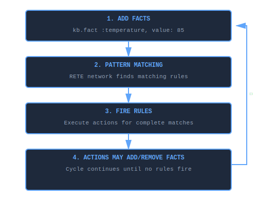

# What is a Knowledge Base?

A **knowledge base** in KBS is a container that holds **facts** (what you know) and **rules** (how to reason about what you know), providing automated inference and decision-making capabilities.

## Core Concept

Think of a knowledge base as a reasoning system that:

1. **Stores facts** - Pieces of information about your domain (e.g., "temperature is 85°F", "stock price is $150")
2. **Defines rules** - Patterns that trigger actions when facts match (e.g., "IF temperature > 80°F THEN alert")
3. **Performs inference** - Automatically detects when rules should fire and executes their actions
4. **Maintains consistency** - Keeps track of what's true and propagates changes efficiently

## Anatomy of a Knowledge Base

A knowledge base consists of three main components:

### 1. Facts (Data)

Facts represent knowledge about your domain. Each fact has:
- **Type** - Category of information (e.g., `:temperature`, `:stock`, `:sensor`)
- **Attributes** - Key-value pairs describing the fact (e.g., `value: 85, location: "server_room"`)

```ruby
kb.fact :temperature, value: 85, location: "server_room"
kb.fact :stock, symbol: "AAPL", price: 150.25, volume: 1_200_000
kb.fact :sensor, id: 42, status: "active"
```

### 2. Rules (Logic)

Rules define IF-THEN patterns that trigger actions when facts match conditions:

```ruby
rule "high_temperature_alert" do
  # IF these conditions match...
  on :temperature, value: greater_than(80), location: :loc?

  # THEN execute this action
  perform do |facts, bindings|
    puts "⚠️  High temperature at #{bindings[:loc?]}"
    send_alert(bindings[:loc?])
  end
end
```

### 3. Working Memory (State)

Working memory holds the current set of active facts. As facts are added/removed, the RETE engine automatically:

- Matches facts against rule conditions
- Tracks partial matches
- Fires rules when all conditions are satisfied

## How Knowledge Bases Work

### The Inference Cycle



*The inference cycle continuously processes facts through pattern matching and rule firing until no more rules can fire.*

### Example Flow

```ruby
kb = KBS.knowledge_base do
  # Define rule
  rule "stock_alert" do
    on :stock, symbol: :sym?, price: greater_than(100)
    perform do |facts, bindings|
      puts "#{bindings[:sym?]} is expensive!"
    end
  end

  # Add fact (triggers pattern matching)
  fact :stock, symbol: "AAPL", price: 150

  # Execute inference
  run  # → Outputs: "AAPL is expensive!"
end
```

## Knowledge Base Types

KBS provides two implementations:

### 1. In-Memory Knowledge Base

**Class**: `KBS::DSL::KnowledgeBase`
**Created via**: `KBS.knowledge_base do ... end`

**Characteristics:**

- ✅ Fast - All data in RAM
- ✅ Simple - No configuration needed
- ✅ Perfect for: Short-lived processes, prototyping, testing
- ⚠️ Volatile - Data lost when process ends

**Example:**
```ruby
kb = KBS.knowledge_base do
  rule "momentum_buy" do
    on :stock, price_change: greater_than(5)
    perform { puts "Strong momentum detected!" }
  end

  fact :stock, symbol: "NVDA", price_change: 7.2
  run
end
```

### 2. Blackboard Knowledge Base

**Class**: `KBS::Blackboard::Engine`
**Created via**: `KBS::Blackboard::Engine.new`

**Characteristics:**

- ✅ Persistent - Facts survive restarts
- ✅ Auditable - Complete history of changes
- ✅ Multi-agent - Supports concurrent reasoning
- ✅ Flexible storage - SQLite, Redis, or Hybrid
- ⚠️ Slower - I/O overhead

**Example:**
```ruby
engine = KBS::Blackboard::Engine.new(db_path: 'kb.db')

engine.add_rule(rule)
engine.add_fact(:stock, symbol: "AAPL", price: 150)
engine.run

# Facts persist even after restart
```

## Key Differences from Databases

| Aspect | Knowledge Base | Database |
|--------|---------------|----------|
| **Purpose** | Reasoning & inference | Storage & retrieval |
| **Operation** | Automatic rule firing | Manual queries |
| **Logic** | Declarative rules | Procedural code |
| **Updates** | Propagate through network | Independent transactions |
| **Focus** | "What should happen when..." | "What data exists..." |

**Example Comparison:**

```ruby
# Database approach (manual logic)
stocks = db.query("SELECT * FROM stocks WHERE price_change > 5")
stocks.each do |stock|
  if stock.volume > 1_000_000
    send_alert(stock.symbol)
  end
end

# Knowledge base approach (declarative rules)
kb.rule "momentum_alert" do
  on :stock, price_change: greater_than(5), volume: greater_than(1_000_000)
  perform { |facts, b| send_alert(b[:symbol?]) }
end
kb.run  # Automatically fires for all matching facts
```

## Common Usage Patterns

### 1. Event Processing

Monitor streams of events and trigger actions:

```ruby
kb = KBS.knowledge_base do
  rule "sensor_timeout" do
    on :sensor, id: :sid?, expected: true
    without :reading, sensor_id: :sid?  # No recent reading
    perform { |facts, b| alert_timeout(b[:sid?]) }
  end

  # Events flow in
  fact :sensor, id: 1, expected: true
  fact :reading, sensor_id: 2, value: 42  # Sensor 1 has no reading!
  run
end
```

### 2. Decision Support

Encode business rules and compliance checks:

```ruby
kb = KBS.knowledge_base do
  rule "approve_loan" do
    on :applicant, credit_score: greater_than(700), income: :income?
    on :loan, amount: :amount?
    perform do |facts, b|
      if b[:income?] > b[:amount?] * 0.3
        approve_loan!
      end
    end
  end
end
```

### 3. Complex Event Detection

Find patterns across multiple related facts:

```ruby
kb = KBS.knowledge_base do
  rule "golden_cross" do
    on :ma_50, value: :fast?
    on :ma_200, value: :slow?
    perform do |facts, b|
      if b[:fast?] > b[:slow?]
        puts "Golden cross detected - bullish signal"
      end
    end
  end
end
```

### 4. State Machine Management

Model workflows and state transitions:

```ruby
kb = KBS.knowledge_base do
  rule "order_to_shipping" do
    on :order, id: :oid?, status: "paid"
    on :inventory, available: greater_than(0)

    perform do |facts, b|
      order = query(:order, id: b[:oid?]).first
      retract order
      fact :order, id: b[:oid?], status: "shipping"
    end
  end
end
```

## Relationship to Other Components

A knowledge base integrates several KBS components:


*A knowledge base is composed of three layers: the DSL provides the user interface, working memory stores facts, and the RETE engine performs pattern matching and inference.*

## When to Use a Knowledge Base

✅ **Good fit:**

- Complex business rules that change frequently
- Multi-condition pattern matching
- Event correlation and monitoring
- Expert systems and decision support
- Workflow and state machine management
- Real-time stream processing

❌ **Not ideal for:**

- Simple CRUD operations
- Pure data storage without logic
- High-throughput data pipelines (use specialized tools)
- When performance is more critical than maintainability

## Advanced Concepts

### Variable Binding (Join Tests)

Variables link facts across multiple conditions:

```ruby
rule "order_fulfillment" do
  on :order, product_id: :pid?, quantity: :qty?
  on :inventory, product_id: :pid?, available: :avail?
  # :pid? creates a join - both facts must have same product_id

  perform do |facts, b|
    if b[:avail?] >= b[:qty?]
      ship_order(b[:pid?])
    end
  end
end
```

### Negation (Absence Testing)

Rules can fire based on *missing* facts:

```ruby
rule "missing_config" do
  on :system, initialized: true
  without :config, loaded: true  # No config fact exists
  perform { raise "Configuration missing!" }
end
```

### Priority Control

Control rule firing order (Blackboard only):

```ruby
rule "critical_alert" do
  priority 100  # High priority fires first
  on :alert, level: "critical"
  perform { shutdown_system! }
end

rule "log_alert" do
  priority 1  # Low priority fires last
  on :alert, level: :level?
  perform { |facts, b| log(b[:level?]) }
end
```

## Performance Considerations

Knowledge bases excel when:

- Rules are stable (compiled once)
- Facts change frequently (efficient incremental matching)
- Multiple rules share patterns (network node sharing)

**Optimization Tips:**

1. **Order conditions by selectivity** - Most restrictive first
2. **Use specific patterns** - `value: 85` better than `value: greater_than(0)`
3. **Limit negations** - Each negation adds overhead
4. **Batch fact additions** - Add all facts, then call `run` once
5. **Use indices** - Blackboard stores support indexed queries

## Further Reading

- **[DSL Reference](guides/dsl.md)** - Complete guide to defining rules
- **[RETE Algorithm](architecture/rete-algorithm.md)** - How pattern matching works
- **[Blackboard Architecture](architecture/blackboard.md)** - Persistent knowledge bases
- **[Getting Started](quick-start.md)** - Practical examples
- **[API Documentation](api/index.md)** - Class and method reference

## Summary

A **knowledge base** is:

- A container for **facts** (data) and **rules** (logic)
- An inference engine that automatically detects when rules should fire
- A declarative way to express "IF these patterns exist THEN take this action"
- Available in both **in-memory** (fast, volatile) and **blackboard** (persistent, auditable) implementations

Think of it as a database that actively reasons about its contents rather than passively storing them.
