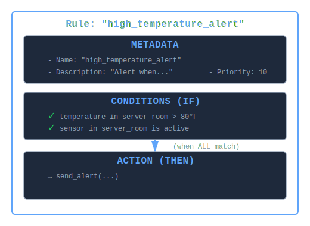
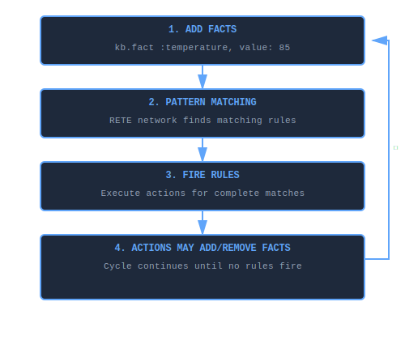

# What is a Rule?

A **rule** is a declarative IF-THEN statement that defines what action to take when certain patterns of facts exist in the knowledge base. Rules are the "logic" that operates on facts (the "data").

## Core Concept

Think of a rule as an **automated detector and responder**:

- **IF** these patterns exist in the knowledge base (conditions)
- **THEN** execute this action (perform block)

Unlike procedural code that you explicitly call, rules **automatically fire** when their conditions are satisfied.

## Anatomy of a Rule

### Basic Structure

```ruby
rule "high_temperature_alert" do
  # 1. METADATA (optional)
  desc "Alert when server room temperature exceeds safe threshold"
  priority 10

  # 2. CONDITIONS (the IF part)
  on :temperature, location: "server_room", value: greater_than(80)
  on :sensor, location: "server_room", status: "active"

  # 3. ACTION (the THEN part)
  perform do |facts, bindings|
    send_alert("High temperature: #{bindings[:value?]}°F")
  end
end
```

### Visual Representation



*A rule consists of three parts: metadata (name, description, priority), conditions that must ALL match, and an action that executes when conditions are satisfied.*

## How Rules Differ from Other Programming Constructs

| Aspect | Rule | Function/Method | IF Statement | Event Handler |
|--------|------|-----------------|--------------|---------------|
| **Invocation** | Automatic (pattern match) | Manual (explicit call) | Manual (in code flow) | Event-driven (explicit bind) |
| **When** | When patterns exist | When called | When executed | When event fires |
| **Conditions** | Declarative patterns | Imperative checks | Imperative checks | Event type |
| **Ordering** | By priority/RETE | Call sequence | Code sequence | Event sequence |
| **Scope** | All facts in KB | Parameters passed | Local variables | Event payload |

**Example Comparison:**

```ruby
# Function - Manual invocation
def check_temperature(temp)
  if temp > 80
    send_alert("High temp: #{temp}")
  end
end
check_temperature(85)  # Must explicitly call

# IF Statement - Part of code flow
temperature = sensor.read
if temperature > 80 && sensor.active?
  send_alert("High temp: #{temperature}")
end

# Event Handler - Event binding
sensor.on(:reading) do |temp|
  if temp > 80
    send_alert("High temp: #{temp}")
  end
end

# Rule - Declarative, automatic
rule "high_temperature" do
  on :temperature, value: greater_than(80)
  on :sensor, status: "active"
  perform do |facts, bindings|
    send_alert("High temp: #{bindings[:value?]}")
  end
end
# Fires automatically when facts match!
```

## Rule Lifecycle

### 1. Definition

Rules are defined using the DSL:

```ruby
kb = KBS.knowledge_base do
  rule "golden_cross_signal" do
    on :ma_50, value: :fast?
    on :ma_200, value: :slow?
    perform do |facts, bindings|
      if bindings[:fast?] > bindings[:slow?]
        puts "Buy signal: Golden cross detected"
      end
    end
  end
end
```

### 2. Compilation

When added to an engine, rules are compiled into a RETE network:

```ruby
engine.add_rule(rule)
# Rule compiled into discrimination network
# - Alpha nodes for each pattern
# - Join nodes to combine patterns
# - Production node for action
```

### 3. Activation

As facts are added, the rule's conditions are evaluated:

```ruby
engine.add_fact(:ma_50, value: 52.3)
engine.add_fact(:ma_200, value: 51.8)
# Conditions now satisfied - rule activated
```

### 4. Firing

During `engine.run`, activated rules fire:

```ruby
engine.run
# → "Buy signal: Golden cross detected"
```

### 5. Completion

Actions execute, potentially creating new facts:

```ruby
perform do |facts, bindings|
  # Can add derived facts
  fact :signal, type: "golden_cross", timestamp: Time.now
  # Can retract facts
  retract old_signal
  # Can call external code
  execute_trade(bindings[:symbol?])
end
```

## Rule Components in Detail

### Metadata

Optional information about the rule:

```ruby
rule "fraud_detection" do
  desc "Flag transactions with suspicious patterns"
  priority 100  # Higher priority = fires first (blackboard only)
  # ... conditions and action
end
```

**Name** - Unique identifier

- Should be descriptive and actionable
- Use snake_case
- Example: `"reorder_low_inventory"`, `"escalate_critical_alert"`

**Description**—Human-readable explanation

- Documents the rule's purpose
- Helpful for debugging and maintenance
- Example: `"Reorders products when inventory falls below minimum threshold"`

**Priority**—Execution order (0-100 typical)

- Only affects `KBS::Blackboard::Engine`
- Higher numbers fire first
- Default: 0

### Conditions (The IF Part)

Patterns that must ALL match for the rule to fire:

```ruby
rule "order_fulfillment" do
  # Condition 1: Must have pending order
  on :order, status: "pending", product_id: :pid?, quantity: :qty?

  # Condition 2: Must have inventory for same product
  on :inventory, product_id: :pid?, available: :avail?
  #                         ^^^^^^
  #                    Join test - must match!

  # Condition 3: Must NOT have existing shipment
  without :shipment, order_id: :oid?

  perform do |facts, bindings|
    # Fires when ALL conditions satisfied
  end
end
```

**Condition Types:**

1. **Positive** - Pattern must exist: `on :temperature, value: > 80`
2. **Negative** - Pattern must NOT exist: `without :alert`
3. **Join** - Variables link conditions: `:pid?` in both conditions above

### Action (The THEN Part)

Code executed when all conditions match:

```ruby
perform do |facts, bindings|
  # facts - Array of matched facts (in condition order)
  # bindings - Hash of variable captures {:pid? => 123, :qty? => 5}

  # Can access facts
  order = facts[0]
  inventory = facts[1]

  # Can access bindings
  product_id = bindings[:pid?]
  quantity = bindings[:qty?]
  available = bindings[:avail?]

  # Can make decisions
  if available >= quantity
    ship_order(order)
  else
    backorder(order)
  end

  # Can add facts
  fact :shipment, order_id: order[:id], shipped_at: Time.now

  # Can retract facts
  retract order

  # Can call external code
  notify_customer(order[:customer_id])
end
```

## How Rules Work: The Inference Cycle

Rules participate in an automatic reasoning loop:



*Rules execute within a continuous inference cycle: facts are added, the RETE network matches patterns, activated rules fire and potentially create new facts, triggering another cycle. Inference completes when no new facts are generated.*

**Example:**

```ruby
kb = KBS.knowledge_base do
  # Rule 1: Detect high temperature
  rule "detect_high_temp" do
    on :temperature, value: greater_than(80), sensor_id: :sid?
    without :alert, sensor_id: :sid?
    perform do |facts, bindings|
      # Add alert fact (triggers Rule 2)
      fact :alert, sensor_id: bindings[:sid?], level: "high"
    end
  end

  # Rule 2: Escalate alerts
  rule "escalate_alert" do
    on :alert, level: "high", sensor_id: :sid?
    on :sensor, id: :sid?, critical: true
    perform do |facts, bindings|
      notify_ops(bindings[:sid?])
    end
  end

  # Add facts
  fact :temperature, value: 85, sensor_id: 42
  fact :sensor, id: 42, critical: true

  # Run inference
  run
  # → Rule 1 fires, creates :alert fact
  # → Rule 2 fires (activated by new alert), notifies ops
end
```

## Types of Rules

### 1. Detection Rules

Identify patterns and generate alerts:

```ruby
rule "detect_fraud" do
  on :transaction, amount: greater_than(10_000)
  on :account, new_account: true
  perform { flag_for_review }
end
```

### 2. Derivation Rules

Infer new facts from existing facts:

```ruby
rule "derive_momentum" do
  on :price, current: :curr?, previous: :prev?
  perform do |facts, bindings|
    change_pct = ((bindings[:curr?] - bindings[:prev?]) / bindings[:prev?]) * 100
    fact :momentum, change_pct: change_pct
  end
end
```

### 3. Reaction Rules

Take action when conditions arise:

```ruby
rule "reorder_inventory" do
  on :inventory, product_id: :pid?, quantity: less_than(10)
  perform do |facts, bindings|
    create_purchase_order(bindings[:pid?], quantity: 100)
  end
end
```

### 4. State Machine Rules

Manage transitions between states:

```ruby
rule "pending_to_processing" do
  on :order, id: :oid?, status: "pending"
  on :worker, status: "available", id: :wid?
  perform do |facts, bindings|
    order = query(:order, id: bindings[:oid?]).first
    retract order
    fact :order, id: bindings[:oid?], status: "processing", worker_id: bindings[:wid?]
  end
end
```

### 5. Guard Rules

Prevent invalid states:

```ruby
rule "prevent_duplicate_orders" do
  on :order, customer_id: :cid?, product_id: :pid?, status: "pending"
  on :order, customer_id: :cid?, product_id: :pid?, status: "processing"
  perform do |facts, bindings|
    cancel_duplicate_order(facts[0])
  end
end
```

### 6. Cleanup Rules

Remove obsolete facts:

```ruby
rule "expire_old_alerts" do
  on :alert, timestamp: ->(ts) { Time.now - ts > 3600 }
  perform do |facts, bindings|
    retract facts[0]
  end
end
```

## Rule Patterns and Best Practices

### Pattern: Rule Chaining

Rules can trigger other rules:

```ruby
# Rule 1 creates fact that activates Rule 2
rule "detect_anomaly" do
  on :sensor, value: :val?
  perform { fact :anomaly, value: bindings[:val?] }
end

rule "escalate_anomaly" do
  on :anomaly, value: greater_than(100)
  perform { send_alert }
end
```

### Pattern: Multi-Condition Filtering

Combine multiple conditions to narrow matches:

```ruby
rule "qualified_lead" do
  on :customer, revenue: greater_than(100_000)
  on :interaction, customer_id: :cid?, type: "demo_request"
  on :product_fit, customer_id: :cid?, score: greater_than(80)
  without :opportunity, customer_id: :cid?
  perform { create_opportunity }
end
```

### Pattern: Exception Handling

Use negation to ensure preconditions:

```ruby
rule "process_payment" do
  on :order, status: "confirmed"
  without :payment, order_id: :oid?  # No payment yet
  without :error, order_id: :oid?     # No errors
  perform { charge_customer }
end
```

### Pattern: Temporal Rules

Time-aware reasoning:

```ruby
rule "stale_data_warning" do
  on :reading, timestamp: ->(ts) { Time.now - ts > 300 }, sensor_id: :sid?
  perform do |facts, bindings|
    alert("Stale data from sensor #{bindings[:sid?]}")
  end
end
```

### Pattern: Aggregation

Collect and analyze multiple facts:

```ruby
rule "daily_summary" do
  on :trigger, event: "end_of_day"
  perform do
    temps = query(:temperature).map { |f| f[:value] }
    avg = temps.sum / temps.size.to_f
    fact :summary, avg_temp: avg, date: Date.today
  end
end
```

## Rule Ordering and Priority

### Priority in KBS::Blackboard::Engine

Controls which rules fire first when multiple are activated:

```ruby
rule "critical_shutdown", priority: 100 do
  on :temperature, value: greater_than(120)
  perform { emergency_shutdown! }
end

rule "send_warning", priority: 50 do
  on :temperature, value: greater_than(80)
  perform { send_warning_email }
end

rule "log_reading", priority: 10 do
  on :temperature, value: :val?
  perform { log(bindings[:val?]) }
end

# With temp = 125, fires in order:
# 1. critical_shutdown (priority 100)
# 2. send_warning (priority 50)
# 3. log_reading (priority 10)
```

### Priority in KBS::Engine

Priority is stored but **not used** for ordering - rules fire in arbitrary order.

### When Priority Matters

**Use priority for:**

- Critical safety checks (priority 100)
- System integrity rules (priority 75)
- Business logic (priority 50)
- Logging and monitoring (priority 10)

**Don't rely on priority for:**

- Sequencing actions (use fact dependencies instead)
- Enforcing order between independent rules
- Complex orchestration (use state machines)

## Rules vs. Queries

Rules are **reactive** (fire automatically), queries are **proactive** (you call them):

```ruby
# Rule - Automatic
rule "alert_on_high_temp" do
  on :temperature, value: greater_than(80)
  perform { send_alert }  # Fires automatically
end

# Query - Manual
temps = query(:temperature, value: greater_than(80))
temps.each { |t| send_alert }  # You must iterate
```

**When to use rules:**

- Continuous monitoring
- Event-driven reactions
- Complex multi-condition patterns
- Automatic inference

**When to use queries:**

- One-time lookups
- Reporting and analysis
- Interactive exploration
- When you need explicit control

## Performance Considerations

### Rule Count

- 10-100 rules: Excellent
- 100-1,000 rules: Very good (network sharing helps)
- 1,000+ rules: Good (consider grouping by domain)

### Condition Count

```ruby
# Fast - 1-2 conditions
rule "simple" do
  on :stock, symbol: "AAPL"
  perform { ... }
end

# Typical - 2-4 conditions
rule "moderate" do
  on :order, status: "pending"
  on :inventory, available: greater_than(0)
  on :customer, verified: true
  perform { ... }
end

# Slower - 5+ conditions (but still efficient with RETE)
rule "complex" do
  on :order, ...
  on :customer, ...
  on :inventory, ...
  on :pricing, ...
  on :shipping, ...
  perform { ... }
end
```

### Condition Ordering Impact

**Huge impact** - order by selectivity:

```ruby
# Bad - general first (creates many partial matches)
on :sensor  # 1000 facts
on :alert, level: "critical"  # 1 fact
# → 1000 tokens created

# Good - specific first (creates few partial matches)
on :alert, level: "critical"  # 1 fact
on :sensor  # 1000 facts
# → 1 token created
```

### Action Complexity

Keep actions lightweight:

```ruby
# Good - fast action
perform do |facts, bindings|
  fact :alert, level: "high"
end

# Acceptable - moderate work
perform do |facts, bindings|
  send_notification(bindings[:user_id?])
end

# Avoid - heavy work in action
perform do |facts, bindings|
  # Don't do this in action:
  complex_calculation()
  database_batch_update()
  api_call_with_retry()
  # Instead, add a fact to trigger async processing
  fact :work_item, type: "heavy_task", data: bindings
end
```

## Common Pitfalls

### 1. Forgetting "All Conditions Must Match"

```ruby
# This rule NEVER fires if there's no :inventory fact
rule "process_order" do
  on :order, status: "pending"
  on :inventory, available: greater_than(0)  # What if no inventory fact?
  perform { ship_order }
end

# Fix: Use negation or optional patterns
rule "process_order" do
  on :order, status: "pending"
  without :inventory, available: less_than(1)  # OK if no inventory fact
  perform { ship_order }
end
```

### 2. Expecting Sequential Execution

```ruby
# Rules don't execute in definition order
rule "step1" do ... end
rule "step2" do ... end  # NOT guaranteed to fire after step1

# Use fact dependencies instead
rule "step1" do
  perform { fact :step1_complete }
end

rule "step2" do
  on :step1_complete  # Depends on step1
  perform { ... }
end
```

### 3. Infinite Loops

```ruby
# Bad - creates infinite loop
rule "loop" do
  on :counter, value: :val?
  perform do |facts, bindings|
    # Retracts and re-adds fact → rule fires again → infinite loop!
    retract facts[0]
    fact :counter, value: bindings[:val?] + 1
  end
end

# Fix: Add termination condition
rule "loop" do
  on :counter, value: less_than(10)
  perform do |facts, bindings|
    retract facts[0]
    fact :counter, value: bindings[:val?] + 1
  end
end
```

### 4. Side Effects in Conditions

```ruby
# Wrong - side effects in predicate
counter = 0
on :stock, price: ->(p) {
  counter += 1  # Bad! Runs many times
  p > 100
}

# Right - side effects in action
on :stock, price: greater_than(100)
perform { counter += 1 }
```

### 5. Modifying Facts Instead of Retracting

```ruby
# Wrong - changes don't trigger rules
fact = engine.facts.first
fact[:status] = "processed"  # No rules fire

# Right - retract and re-add
retract old_fact
fact :order, status: "processed"  # Rules fire
```

## Testing Rules

### Unit Testing

Test rules in isolation:

```ruby
def test_high_temp_alert
  kb = KBS.knowledge_base do
    rule "alert" do
      on :temperature, value: greater_than(80)
      perform { fact :alert, level: "high" }
    end

    fact :temperature, value: 85
    run
  end

  alerts = kb.query(:alert)
  assert_equal 1, alerts.size
  assert_equal "high", alerts.first[:level]
end
```

### Integration Testing

Test rule interactions:

```ruby
def test_alert_escalation
  kb = KBS.knowledge_base do
    rule "create_alert" do
      on :temperature, value: greater_than(80)
      perform { fact :alert, level: "high" }
    end

    rule "escalate_alert" do
      on :alert, level: "high"
      on :sensor, critical: true
      perform { fact :escalation, priority: "urgent" }
    end

    fact :temperature, value: 85
    fact :sensor, critical: true
    run
  end

  assert kb.query(:alert).any?
  assert kb.query(:escalation).any?
end
```

## Rule Design Principles

### 1. Single Responsibility

One rule, one purpose:

```ruby
# Good—focused
rule "reorder_low_inventory" do
  on :inventory, quantity: less_than(10)
  perform { create_purchase_order }
end

# Bad—does too much
rule "inventory_management" do
  on :inventory
  perform do
    check_quantity
    update_forecasts
    notify_suppliers
    generate_reports
  end
end
```

### 2. Declarative Over Imperative

Express what, not how:

```ruby
# Good—declarative
rule "qualified_customer" do
  on :customer, revenue: greater_than(100_000)
  on :engagement, score: greater_than(80)
  perform { create_opportunity }
end

# Less ideal—imperative
rule "check_customer" do
  on :customer
  perform do |facts|
    if facts[0][:revenue] > 100_000
      engagement = query(:engagement, customer_id: facts[0][:id]).first
      if engagement && engagement[:score] > 80
        create_opportunity
      end
    end
  end
end
```

### 3. Explicit Over Implicit

Make conditions explicit:

```ruby
# Good—clear dependencies
rule "ship_order" do
  on :order, status: "paid"
  on :inventory, available: greater_than(0)
  without :shipment  # Explicit: no existing shipment
  perform { ship }
end

# Bad—hidden assumptions
rule "ship_order" do
  on :order, status: "paid"
  perform { ship }  # Implicitly assumes inventory exists
end
```

## Further Reading

- **[Writing Rules Guide](guides/writing-rules.md)** - Detailed best practices
- **[Rules API Reference](api/rules.md)** - Complete method documentation
- **[DSL Reference](guides/dsl.md)** - Rule definition syntax
- **[Pattern Matching](guides/pattern-matching.md)** - Condition patterns
- **[RETE Algorithm](architecture/rete-algorithm.md)** - How rules are compiled and executed

## Summary

A **rule** is:

- A **declarative IF-THEN statement** that automatically fires when patterns match
- Composed of **conditions** (patterns to match) and **action** (code to execute)
- **Automatically activated** by the RETE engine when facts satisfy conditions
- The "logic" that operates on facts (the "data") in a knowledge base
- Available with optional **priority** for execution ordering (blackboard only)

Think of rules as **automated sentinels** that continuously watch for specific patterns and react instantly when those patterns appear.
